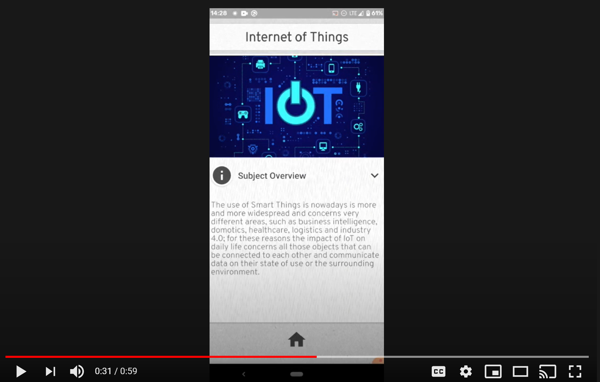

# NotesBites

NotesBites is a mobile app for Android that gathers notes from a range of subjects related to Artificial Intelligence and IoT.

Each course is divided into modules, and each module is made of a markdown page, a video, and a quiz.   
The available courses are: 

- Artificial Intelligence 
- Machine Learning
- Autonomous Agents and Multi-Agent Systems
- Internet of Things
- Recommender Systems
- Artificial Neural Networks and Deep Learning 
- Reinforcement Learning   

An exhaustive documentation on the project can be found in the folder "resources". 

Authors:

- Filippo Antonielli
- William Bonvini

