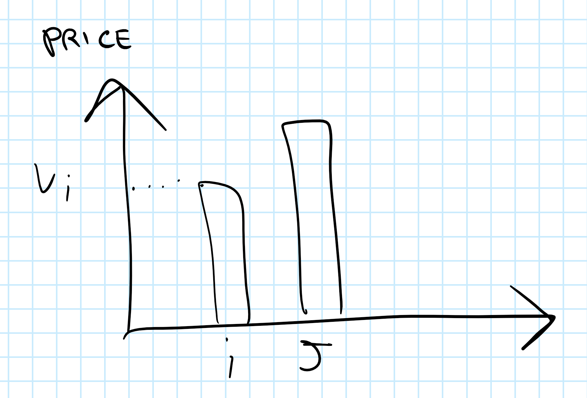

# Auctions - Part 1

Auctions ("aste" in italian) are very useful in the real world, for example: 

- in the stock market
- public concourse

An auction is made out of an auctioneer (usually the one who sells) and some agents (usually the ones who buy).  roles could be the opposite, for example for public concourses, in that case the auctioneer is the one who buys.

When you set up an auction you have to set up the rules of the auction. for example if you are the owner of  Ebay you have to say what is the minimum and maximum price or which user can sell an item.  
You have to set even the rules: for example, is it possible to propose a price and get immediately the item? or we must wait for the end of the auction?

What an agent decides to do is called *strategy*.

***Different kinds of goods' auctions***

- <u>single-good</u>  
  you make an offer only for one item  
  (i.e. Van Gogh's painting auction)
- <u>multi-good</u>  
  you make an offer for some of a set of goods, or all of them, or just one.  
  (i.e. telecommunication auctions)

if you are the buyer you can fix a maximum price that you are willing to offer.  
At the same time, if you are the seller, you can fix a minimum price that you are willing to accept.    
This last price is called ***reservation price***.

#### Canonical Auctions

- <u>English Auctions</u>  
  The auctioneer announces an initial price (the reservation price).  
  The agent can make a new offer with the following constraint: the new offer should be larger than the largest offer made so far by any of the other agents.  
  When the auction in this case ends? when there is no new offer.  
  The agent will pay exactly the amount of money that he has offered.

  - offer made by agents
  - usually big jump of prices
  - the auctioneer is more passive. he has no control

- <u>Japanese Auctions</u>  
  At the beginning all the agents will be standing up. The auctioneer will start from his reservation price and he will call increasing prices.  
  If an agent sits down he is out of the auction forever.  
  The winner is the last standing agent.  
  The amount of money he will pay is the price that the auctioneer has proposed at last.  
  What happens if we have two agents standing and they sit down at the same time?  
  One tie-breaking mechanism is: a new auction is run just for those agents.

  - offer made by auctioneer.
  - more linear.
  - the auctioneer is more in control of the situation.

- <u>Dutch Auctions</u>  
  there is a clock. it does not show the time but the price.  
  it starts from a really high price and goes down.   
  the auction ends when one of the agents stops the clock.  
  The winner is the agent that stopped the clock and the amount of money he will pay is the price that is displayed by the clock at time of stopping.  
  (i.e. for selling flowers, for selling fish. it is really fast. used for selling things that are not of a big value and you have to sell them fast.   
  the auctioneer can set the speed of the clock)

- <u>Sealed-bid Auctions</u>  
  the agents are sending their bids (offer) to the auctioneer using a sealed envelope.  
  There are several families of sealed-bid auctions, but we'll see just two:

  - ***First Price***  
    The auctioneer selects the largest possible offer.  
    The agent that made the best offer will get the item and pays exactly the amount he has offered.
  - ***Second Price*** (also called Vickrey auction)   
    The auctioneer selects the largest possible offer.  
    the winner is the one that made the largest offer but he does not pay his offer, but the second highest.

  (used for allocating public works/concourses). 
  Sealed-Bid auctions are *asynchronous*! no need to have all the agents present at the same time in a specific place.

#### Common value & IPV

if in an auction I'm selling a 1 euro coin, would you pay more than 1 euro for it? no, if it has no special feature.  all the agents agree on a price, that is the ***common value***.  
If such coin was instead a very very rare one? it would have a higher value. 

Another example: I'm going to buy a house. I've to consider many characteristic depending on my needs (if I'm in a wheelchair I will value it more if it develops on just one floor).   
It has a different value depending on the person that is going to buy it.  
In the case above we'll then assume that goods have ***independent private values*** (IPV).

####  Considerations on IPV

***Considerations on Second Price Sealed-Bid Auctions***

Now let's do some considerations on Second Price Sealed-Bid Auction:

==If I'm using Second Price Sealed-Bid Auction, offering your true evaluation of the object is the dominant strategy (if you think that the object is worth 50, you offer 50).==

why? here it is:

Case 1:    
$i$ is going to win this auction.   
$v_i$ is $i$'s monetary evaluation of the object.  
the $y$ axis represents the price paid.

is it wise for $i$ to propose a higher offer? yes, he would still pay the amount offered by $j$.    
Is it wise for $i$ to propose a lower offer? no, he could lose the item.

Case 2:   
$j$ is going to win this auction.

is it wise for $i$ to propose a higher offer? no because if you offer more than $v_i$ you could end up with gaining the item, but paying more than what you value it (you value it $v_i$), which is not rational.  
is it wise for $i$ to propose a lower offer? no because it would reduce his chances of getting the item.  
In a nutshell:    
==Second Price Sealed-bid Auctions enforces the agents to tell the truth!!==

***Considerations on English and Japanese Auctions***

==the winning strategy is to offer an increase until my true evaluation.==

***Considerations on Dutch and First Price Sealed-Bid Auctions***

==There is no dominant strategy in this case.==

There are though some interesting results: 

- strategical equivalence
- equilibrium strategies
- risk neutrality

*Dutch and FPSB are **strategically equivalent**.*

Why?

let's suppose there are 4 agents and I'm involved in a Dutch auction. 
the price starts at 100 and it reaches 80, which is my true value for the item. should I stop or not?   
If I don't know how much the other agents are willing to pay, it could be that it is not the best thing to do to stop the evaluation, because I could end up paying less for the item.   
the same happens with FPSB (if I know that the second highest offered value is 70, I can offer 71, even if my true value is 80).

In this cases we can have some ***equilibrium strategies***: if an agent deviates from his strategy and the others are not changing theirs, such agent is going to lose (same thing as Nash Equilibrium).

If you have $n$ agents, the following is an equilibrium strategy:
$$
\bigg(\frac{n-1}{n}v_1,\frac{n-1}{n}v_2,...,\frac{n-1}{n}v_n\bigg)
$$
where $v_i$ is the true value for agent $i$ (the value he is willing to pay).

#### Risk Neutrality

Agents can be ***risk neutral***:    
Let's explain it via an example.  
I have 0 euro in my pockets. you give me a bill of 10 euros. my utility was zero, now it is 10, good. now let's instead assume I have a million euros in my pocket. you give me 10 euros. the increment is exactly the same in both cases, but in the first case I value more passing from 0 to 10, then from 1 million to 1 million and ten. The scenario just described is *not* risk-neutral.  
==I'm risk neutral if I value in the same way the increment, independent on how much I have.==

#### Auctioneer's Point of View

Let's now talk about the auctioneer:

If I'm going to set up an auction, what mechanism should I choose?

***Revenue Equivalence Theorem***

$n$ risk-neutral agents.

IPV.

the values $v_i$ are uniformly taken from an interval that is $[ \ \underline{v} \ ,\ \overline{v} \ ]$.

if 

- the good is allocated to the agent that made the largest evaluation (not the largest offer!)
- the agent with the smallest evaluation has basically no chance to get the good.   
  (it's expected utility is set to zero)

then

- any kind of auction that satisfies such preconditions provides to the auctioneer the same expected revenue

==all the auctions that we have seen satisfy the preconditions, so all of them are equivalent from the point of view of the auctioneer.==

***things to think about for next lecture***

- take the English auction, try to verify that the good is always allocated to the agent with the largest $v_i$.
- try to think what is the amount of info that agents participating in auctions are disclosing to the others in the different auctions we have seen.

this will show me why sealed bit auctions are very popular in real world scenarios.