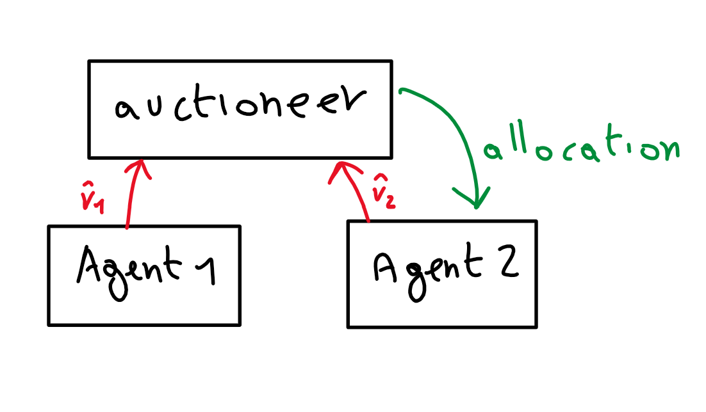
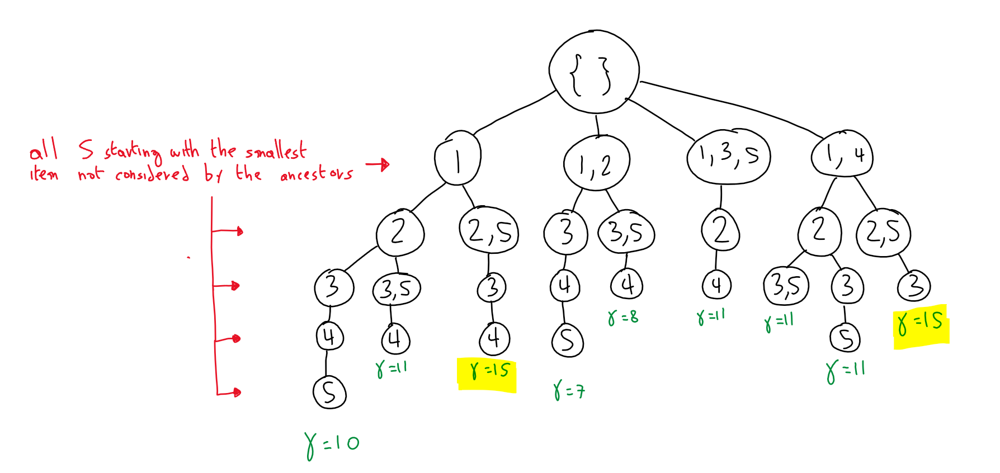

# Multiple Items Auctions

### Introduction

In this scenario we have that multiple items are auctioned at the same time.

Multiple good/item auctions are combinatorial auctions, they are called this way because we use a combinational approach to solve them.

Example: A company selling stocks in blocks $\to$ you can make an offer for the first and third stock blocks, or for the first and the second one.

the problem is described with the following elements:

- **Agents** $N={1,2,3,…,n}$

- **Goods** $G={1,2,3,…,m}$

- **Valuation function**    
  The domain is the power set (set of all possible subsets) of the goods.   
  The codomain is a real number.   
  To every subset of goods is associated a real number.   
  $$
  v_i:2^G \to \R
  $$

- **bid submitted to the auctioneer by agent $i$**   
  $$
  \hat{v}_i
  $$

- $v_i-\hat{v}_i$

- Agents can decide not to make an offer for one or a group of goods.

- Agents can offer less than the real value

***Extension to the combinatorial auction***

Important difference: this time the bid is not a number, it is a function.  
The auctioneer will receive all the bids and will decide which agent is the winner $\to$ difficult to do.

***Complementarity***

The evaluation function can express some sort of complementarity when the value of the union between two disjoint subsets of $G$ is larger than the sum of the two.   
If it holds for every subset it means that agent $i$ thinks that having goods together is better than having them alone.   
That means that the two objects are complementary. (Right and left shoes for example).
$$
T,S \subseteq G; \ \ \ \ T \cap S=\{\}; \ \ \ \ v_i(T\cup S)> v_i(T)+v_i(S)
$$

***Substitutability***

The value that agent $i$ gives to two objects together is less than the value of the sum (two tickets of the same play in different days).

If you are the seller the best thing to do in the substitutability case is to sell one item at the time (same cases of the previous lesson)
$$
T,S \subseteq G; \ \ \ \ T \cap S=\{\}; \ \ \ \ v_i(T\cup S)< v_i(T)+v_i(S)
$$
***Additivity***
$$
T,S \subseteq G; \ \ \ \ T \cap S=\{\}; \ \ \ \ v_i(T\cup S)= v_i(T)+v_i(S)
$$
$\to$ not interested in having them together

### Winner Determination Problem

***Integer Linear Optimization Problem***

Let's make an example showing that complementarity can be a problem.  
You are the auctioneer and you receive this offer:
$$
N=\{1,2,...,n\}=\text{set of buyers}
$$

$$
G=\{1,2,3,4,5\}= \text{set of items}
$$

| $S$ = Item | $\bar{v}(S)$ = Best offer for such item/items |
| ---------- | --------------------------------------------- |
| 1          | 5                                             |
| 2          | 4                                             |
| 5          | 1                                             |
| 1,2        | 6                                             |
| 1,3,5      | 7                                             |
| 1,4        | 5                                             |
| 2,5        | 10                                            |
| 3,5        | 2                                             |

Some items (or subsets of items) have not received any offer.

Let's introduce some notation:

Considering $S\in 2^G,i\in N$:  
The subset of items $S$ goes to agent $i$ if $x_{S,i}=1$. Otherwise $x_{S,i}=0$.

$X$ is a vector called allocation, and corresponds to the distribution of $X_{S,i}$.  
We have to solve the following integer linear optimization problem:
$$
\max \sum_{i \in N}\sum_{S \in G} \hat{v}_i(S)x_{S,i}
$$
$x_{S,i} \in \{0,1\} \ \ \ \  \forall S \subseteq G \ \ \ \ \forall i \in N$

*Constraint $1$*: I can sell every item at most to one buyer
$$
\sum_{S|j \in S}\sum_{i \in N}x_{S,i}\le 1 \ \ \ \ \forall j \in G
$$
*Constraint* $2$: To each buyer is associated one and only one subset of bought items (could be the empty set as well).  
$$
\sum_{S \in G}x_{S,i}=1 \ \ \ \ \forall i \in N
$$
As already said this is an *Integer* linear problem. being so, it is more difficult to solve with respect to typical linear optimization problems.  
It is proved to be $	\text{NP-Hard}$, so it can be solved optimally only for small instances.  
The idea is to find a good solution for the auctioneer, in general.

***Algorithm***

*Step 1: Fill the table*

Let's add to the table all the bids we have not received for $S$ of cardinality $1$ (single item).

| S = Item | $\bar{v}(S)$ = Best offer for such item/items |
| -------- | --------------------------------------------- |
| 1        | 5                                             |
| 2        | 4                                             |
| 5        | 1                                             |
| 1,2      | 6                                             |
| 1,3,5    | 7                                             |
| 1,4      | 5                                             |
| 2,5      | 10                                            |
| 3,5      | 2                                             |
| ==3==    | ==0==                                         |
| ==4==    | ==0==                                         |

*Step 2: Tree Building*

Root = Empty set.  
I will add a child for every bid I have received that

1. contains the smallest items (item $1$ is considered smaller than item $2$, etc) not yet on the path
2. does not contain any item already in the path

$\gamma=\text{cost of a specific path}$

Stop as soon as you have considered all the items in $G$.

Leaves are all the possible allocations of goods (disjoint and containing all the items).

$x^* \leftarrow \{\}$

$g^* \leftarrow 0$

$\text{Branch-On-Items($1$,\{\})}$

with:

$\text{Branch-On-Items($i$,$x$)}$

​	$\text{if bids $S$ in $x$ involve all goods}$

​			$\text{if } \sum_{S \in x}\bar{v}(S)>g^*$  

​						$g^* \leftarrow \sum_{S \in x}\bar{v}(S)$

​						$x^* \leftarrow x$

​			$\text{return}$

​	$\text{for bids $S$ s.t. $i \in S$ and $S \cap (\cup_{S' \in x}S')=\{\}$}$

​			$x' \leftarrow x + s$

​			$\text{if $\sum_{S \in x'}\bar{v}(S)+h(x')>g^*$}$

​					$\text{Branch-On-Items($\color{red}i'\color{black},\color{orange}x'$)}$

$\color{red}\text{smallest item not in $x'$}$.

$\color{orange}\text{new allocation}$.

Let's talk a little about the terms in the algorithm:

- $h(x')$ is a heuristic function: it's an upper bound (gives an overestimate) of what I can get when I allocate items that are not in $'x$
  - how to compute $h(x')$?  
    use this function for example:  
    $h(x')=\sum_{i \in \text{items not in $x'$}}\max_{S|i\in S}\frac{\bar{v}(S)}{|S|}$
  - in our example:  
    $i=1, \ \ \ \ \  \max{\frac{5}{1},\frac{6}{2},\frac{7}{3},\frac{5}{2}}$
- $\bar{v}(S)$ is the value of my current allocation
- $g^*$ is the current best solution.