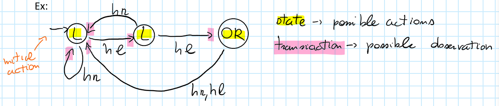

# Multi Agent Planning - Part 2

Let's continue the example started in *Multi Agent Planning Part 1*.

What is a solution to this problem?

In a MDP a policy is a function that given a state returns an action.  

Right now, being the states not observable, the information that an agent has in this context is the sequence of observation he has done. So we have to change the definition of a policy for this kind of problems.

***Policy***  
The policy $q_i$ is a mapping from a sequence of observations to an action.

***Finite Horizon***  
There’s a finite number of actions in which the game can evolve.   
In this case a tree is the best possible representation for the policy

   

In this case an action $OR$ or $OL$ can be performed only after two listenings.   
In this case we have assumed that the observations are the same for all the agents. The policy tree for the two agents will be binary (left or right for every node), but it’s possible that the possible observations of different agents are different in general. 

The drawn policy refers to agent 1. The policy of agent 2 is the same.

***Infinite Horizon***

The depth of the policy tree can be infinite. So we can’t use a tree for the representation. In this case it’s common to use a finite state machine. 

We can built different finite state controller with any number of states.  
The one in the example is a finite state controller for a single agent.

*How to find the optimal policy*?

For finite horizon: Given an initial state $s_0$ and a given $\bar{q}$, which is the joint policy, I will define a function $V$ that returns the expected reward.
$$
V(s_0,\bar{q})=E\bigg[\sum_{t=0}^{T-1}R(s_t,\bar{a}_t)|s_0,\bar{q}\bigg]
$$
which can be read as the average over the sum of the rewards that I can get starting from a particular state and following a particular sequence of actions.  
The objective is to find a joint policy $\bar{q}$ that maximizes the reward.
$$
\bar{q}^*=\arg\max_{\bar{q}}V(s_0,\bar{q})
$$
How difficult is this problem?  
Given $T$ (horizon $\to$ policy tree length ) the complexity of solving this problem is $NEXP-hard$.  
This means super exponential (more than exponential). In fact I have to build every possible sequence of actions of length $T$ for every agent evaluating the joint probability every time.

For infinite horizon: the goal becomes to find the best among all possible combinations of all the possible finite state controllers having $T$ number of states:
$$
V(s_0,\bar{q})=E\bigg[\sum_{t=0}^{+\infty}d\cdot R(s_t,\bar{a}_t)|s_0,\bar{q}\bigg]
$$
where $d=\text{discount factor}$.

     
In the case of 3 states those are the optimal policies for player $1$ and player $2$.  
One agent checks one door, the other checks the other one and they join the knowledge coordinating themselves.   
We will see a few steps of an actual algorithm to solve this kind of problems (this algorithm is not effective with high $T$).
$$
V(s_0,\bar{q})=R(s_0,\bar{a})+\sum_{s',\bar{o}}\color{orange}P(s'|s_0,\bar{a})\color{black}\color{green}O(\bar{o}|\bar{a},s')\color{black}V(s'|\color{red}\bar{q}_\bar{o}\color{black})
$$
As we can see our expected reward ***depends*** on the $\color{orange}\text{transition function}$, and on the $\color{green}\text{observation function}$.  
$\color{red} \text{joint policy composed of the sub-trees of the initial policy}$.

The meaning of the term $P(s'|s,a)O(\bar{o}|s,\bar{a})$ is that we have to consider all the possible combinations of all the possible actions with all the possible observations.

The underlying idea is to try to solve the problems with an increasing dimension of the horizon:

==$T=1 \to$==

Tree composed of a single level (the possible actions)  
$L \ (q_1),OR \ \ (q_2), OL(q_3) \to \bar{q}=<q_1,q_2,q_3>$.  
All possible combinations of joint policies $(\bar{q}\times \bar{q})$ are $ 9 \ (3\cdot 3)$.

Fixed a particular joint policy $<q_1,q_1>$  
$V(T_L,<q_1,q_1>)=R(T_L,<L,L>)=-2$.   
In this case, on the right member of the equation, we do not have any term $P,O,V$ because $T=1$.

We have to compute $V$ for all the $9$ possible joint policies.

$V(T_L,<q_1,q_2>)=R(TL,<L,OR>)=9$

and so on...

==$T=2 \to$==

  $\dots$ 

The total number of possible different trees for a single agent is $3 \times 3^2 = 27$   
The number of possible joint policies are $27\cdot 27$.

Now consider we fixed the policy for agent $1$: $<q'_1,q'_1>$.

$V(TL,<q_1',q_1'>)=\\ R(TL,<L,L>)+ \\ P(TL|TL,<L,L>)O(<hl,hl>|TL,<L,L>)V(TL,<q_1,q_1>) + \\ P(TL|TL,<L,L>)O(<hl,hr>)... + \\ P(TR|TL,...)...$

Keep in mind the meaning of the tuple $<q_1,q_1>$:

The possible states are $TL,TR \to s'$.

The possible observations are $<hl,hl>,<hl,hr>,<hr,hr>,<hr,hl>\to\bar{o}$.

Considering even the one with probability  associated $=0$.
$$
V(s_0,\bar{q})=R(s_0,\bar{a})+ \sum_{s',\bar{o}}P(s'|s,\bar{a})O(\bar{o}|,s,\bar{a})V(s'|\bar{q}_{\bar{o}})
$$
(the formula above doesn't makes sense: $s$ is probably $s'$, but Amigoni wrote it twice like that... I wrote a senseful version of the formula somewhere earlier).  
Then, all the $q_i,q_j$ combinations have to be considered.

Then $T=3$ has to be considered.

***Possible ways of reducing complexity***

- Consider the dominated and dominating policies. (Very complex, not described)
- Too complex to find the optimal policy $\to$ look for something simpler: *a joint equilibrium policy*.

***Joint Equilibrium Policy***

$<q_i,q_j>$ fixed for agent $1$, find the optimal policy for agent $2$.

$<q_i,q_j> $ fixed for agent $2$, find the optimal policy for agent $1$.

If I can find two policies such that given policy of player $1$, player $2$ can’t find a better policy and vice versa that’s an equilibrium.   
The solution may not be optimal but the complexity is “just” exponential.