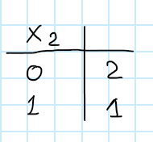

# DCOP - DPOP & MaxSum

### DPOP in action

Let's refresh the constraint satisfaction problem seen last time:

| $x_1 $ | $x_2 $ | $F_{ij}$ |
| ------ | ------ | -------- |
| 0      | 0      | 2        |
| 0      | 1      | 0        |
| 1      | 0      | 0        |
| 1      | 1      | 1        |

***Util Propagation - Phase 1***
$$
U_{i\to j}(Sep_i)=\max_{x_i}(\otimes_{p \in Sep_i}F_{p,i})
$$
$U_{i\to j}$ is a message sent by agent $i$ to its parent $j$.

$C_i$ is the set of children of agent $i$.

$P_i$ is the set of parents of agent $i$ (it's a single element).

$PP_i$ is the set of pseudo-parents of agent $i$.

$U_{4\to 2}(Sep_4)=U_{4\to 2}(x_1,x_2)=$ 

= 

What have we done above? we just summed up the values $F_{24}$ and $F_{14}$. Afterwards we selected the maximum $F$ pairwise (considering value $F$ with the same combination of $x_1$ and $x_2$, which means: we selected the value of $x_4$ that maximized $F$).

$Sep_4=(\text{agent $2$, agent $1$})$

  
  

This is the end of the first phase.

We can see here that only few messages were exchanged.

==The complexity is in the size of the messages: the size of the messages can be exponentially large==. But how large?

Which is the main parameter? The size of the separator. 

The worst possible case for the size of the separator = largest messages that they can send = when the separator of an agent is composed by all the other agents. 

***Value Propagation - Phase 2***

Each agent will calculate this value:
$$
x^*_i=\underset{x_i}{\text{argmax}}\Bigg(\sum_{A_j \in C_i} U_{j \to i}(x_i,x^*_p)+ \sum_{A_j \in P_i \cup PP_i}F_{i,j}(x_i,x_j^*)\Bigg)
$$
$x^*_i$ is the value agent $i$ chooses for its variable.

$x_p^*$ is the value already set for some variables.

let's compute it for agent $1$

$x_1^*=\underset{x_1}{\text{argmax}}\bigg(U_{2 \to 1}(x_1)+0\bigg)=0$.

the first term of the argmax is like that because the children of agent $1$ is just agent $2$ (look the pseudo tree).  
the second term of the argmax is zero because agent $1$ has no parents or pseudo parents.

now let's introduce another value:
$$
V_{i\to j} \ = \ \big\{x_i=x_i^*\big\} \ \ \ \  \cup \bigcup_{x_s \in Sep_i \cap Sep_j} \big\{x_s=x_s^*	\big\}
$$
in our example we have that $V_{1\to 2}= \ \big\{x_1=0\big\}$.

the values of agent $2$ are:
$$
x_2^*=\underset{x_2}{\text{argmax}}\bigg(U_{3 \to 2}(x_1^*,x_2)+U_{4 \to 2} (x_1^*,x_2)+F_{1,2}(x_1^*,x_2)\bigg)=0
$$

$$
V_{2 \to 3}=\{x_2=0\}\cup \{x_1=0\}
$$

$$
V_{2 \to 4}= \{x_2=0\} \cup \{x_1=0\}
$$

the size of the messages $V$ is not so big.

### MaxSum Algorithm

now we switch from DPOP to another algorithm that is suboptimal (the optimal solution is not guaranteed, it does not even guarantee to terminate).

MaxSum is based on the concept of semi-ring. it belongs to the class GDL (Generalized Distributed Law).

How does it work? iteratively exchanges messages with its neighbors. 

What messages do they exchange? just one type:
$$
m_{i \to j}(x_j)=\alpha_{ij}+max_{x_i}\bigg(F_{ij(x_i,x_j)}+\sum_{A_k \in N_i-\{j\}}m_{k\to i}(x_i)\bigg)
$$
where all $m_{k\to i}$ in the summation are the messages that agent $i$ receives from its neighbors, without considering the message received from the neighbor $j$.

$\alpha_{ij}$ is set in such a way that the sum of the messages is $0$ $(\sum_{x_j}m_{i\to j}=0)$. It's a normalization constant.
$$
m_{1 \to 2}(x_2)=\max_{x_1}(F_{1,2}(x_1,x_2)+m_{3 \to 1}(x_1)+m_{4 \to 1}(x_1))
$$
=   

at the beginning of the algorithm, the second and the third term in the max above are zero.

the messages to be exchanged are $m_{1 \to 3},m_{1 \to 4},m_{2 \to 1},m_{2 \to 3},m_{2 \to 4}$.

When does the algorithm terminate? When you reach convergence: when all the agents will receive the same message twice. ‘Two consecutive times’ is hard to formalize because the messages are asynchronous. The problem of termination is a hard problem. 

We assume there is some mechanism to stop computation.

Assume we reached convergence, what is the solution? Each agent can calculate a local function $z$.

***Comments on $\alpha$:***

If you sum continuously things it is hard to have something equal for two steps. We need to normalize something in order not to sum everything. We sum at all steps but at some point we need to normalize. This is the role of alpha.

normalizing (=scaling some values).

***Other comments:***

MaxSum is a suboptimal algorithm, in general it has no guarantee to converge, it may continue forever. However if it convergences it does it to a neighborhood maximum (like a local maximum). 

==If the initial graph is acyclic (no cycles) it is possible to prove that MaxSum convergences and it convergences at the optimal solution.==

This is also the idea to prove some ***approximation properties***:

MaxSum reaches solution that are at a bounded distance from the optimal solution. 

If you have a graph that is cyclic then you eliminate some constraints and you get the acyclic graph -> you do the MaxSum algorithm and you know what is the maximum approximation that you have from the optimal solution $\to$ you have a bounded version of MaxSum. 

Which arcs should be cut? It’s a hard problem, according to what you cut you have a different approximation bound. 

MaxSum is suboptimal in general but this trick allows to have a bounded MaxSum.

If you look at DPOP and MaxSum, we need to know the values that other agents have chosen for their variables (at some point, or we can reconstruct those values somehow). In some application this is something that you don’t want $\to$ there are over-complicated versions so that you can use some sort of cryptography. There are algorithms such that you can promise a global function using local variable and never disclosing which are those values. Right now it is completely unpractical. 