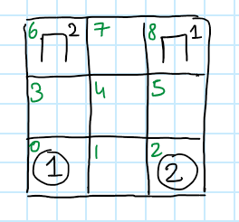
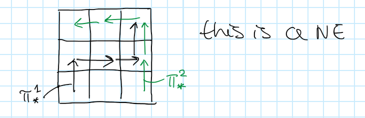
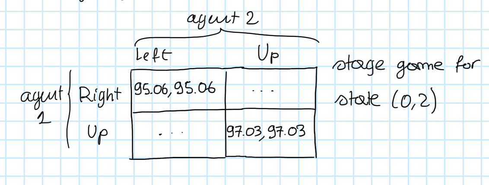
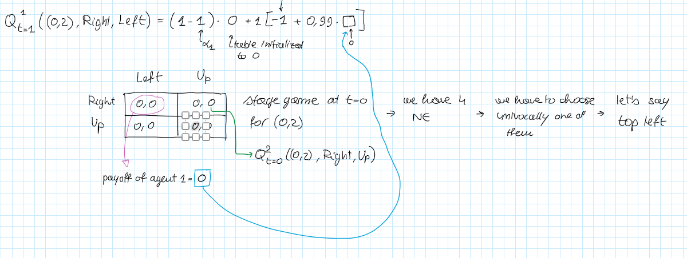

# Multiagent Learning - Part 2

***Multi Agent Learning***

$S$

$A^1,\dots,A^n$

$r^1,\dots, r^n$

$P$

$\pi^i$

$V^i(s,\pi^1,\dots,\pi^n))$ value function

$\pi^1_*,\dots, \pi^n_*$ Nash Equilibrium

***Example***

$S=\{(0,0),(0,1),\dots\}$ set of states

$s_0=(0,2)$ initial state: agent $1$ is in cell $0$ while agent $2$ is in cell $2$.

$A^1=A^2=\{\text{left,right,up,down}\}$

$r^1=r^2$

when at least one agent reaches its station both get $100$.

we assume that the transition function is fully deterministic.

Here a policy is a path:

value function:

$V^1((0,2),\pi^1_*,\pi^2_*)=0.99^0\cdot 0+0.99\cdot 0+0.99^2\cdot 0+0.99^3\cdot100=97.03$

$V^1((3,5),\pi^1_*,\pi^2_*)=98.01$

$\beta = 0.99$

### Nash Q-function

$$
Q^i_*(s,a^1,\dots,a^n)=r^i(s,a^1,\dots,a^n)+\beta \sum_{s'\in S}P(s'|s,a^1,\dots,a^n)V^i(s',\pi^1_*,\dots,\pi^n_*)
$$

It is similar to the value function:

==The value function is defined over policies/strategies== (like a sequence of steps, a path in a deterministic world), ==while the Nash Q-function is defined over actions==

In our example:
$$
Q^1_*\big((0,2),\text{right},\text{left}\big)=r^1((0,2),\text{right},\text{left})+ \beta \cdot V^1\big((0,2),\pi^1_*,\pi^2_*\big)=
$$

$$
=-1+0.99\cdot 97.03=95.06
$$

This is the value of the Nash Q function when starting in $(0,2)$ and performing $\text{right, left}$.

What if agents instead, starting from $(0,2)$, go $\text{up,up}$?

$Q^1_1((0,2),\text{up,up})=0+0.99 \cdot V^1((3,5).\pi^1_*,\pi^2_*)=0+0.99\cdot 98.01=97.03$

You can do the same for agent $2$.

At the end, if you calculate the Nash Q-function, you are implicitly defining a strategic game in normal form that is a Stage Game:

==the Nash Q values for a given state are defining a stage game==.

***Stage game in our example***

In what sense the game is stochastic?...

### Nash Q-learning algorithm

Can we learn by trial and error policies that are in Nash Equilibrium? yes, via the Nash Q-learning equilibrium.

$S$

$A^1,\dots,A^n$

$\color{red}\text{NO  } r^1,\dots, r^n$

$\color{red}\text{NO }P$

$\pi^i$

$V^i(s,\pi^1,\dots,\pi^n))$ value function

$\pi^1_*,\dots, \pi^n_*$ Nash Equilibrium

***Assumptions***

we assume agents are able to observe:

- the actions performed by the other agents
- the reward got by other agents
- the state of the environment

each agent will learn the Q-function of all the other agents

$Q^i_t(s,a^1,\dots,a^n)$ is the Q-function of agent $i$ at time $t$

in our example:

$Q^1_t(s,a^1,a^2)$

with $|S|=57, |A^1|=4,|A^2|=4$

***Algorithm***

1. initialization phase
2. each agent will perceive the state of the world and decide what to do
3. each agent receives its reward and other agents' rewards with the actions they performed
4. update Q-function

***Initialization***

set all to $0$:

$Q^1_0(s,a^1,a^2)=0$

$Q^2_0(s,a^1,a^2)=0$

***Formula***

The Q-function of an agent can be updated in this way:
$$
Q^i_{t+1}(s,a^1,\dots,a^n) =(1-\alpha_t)Q_t^i(s,a^1,\dots,a^n)+\alpha_t\bigg(\color{green}r_t^i\color{black}+\color{red}\beta \ \text{Nash}Q_t^i(s')\color{black}\bigg)
$$
$\color{green}\text{Observed Reward}$

$\color{red}\text{The payoff that agent $i$ gets for the NE of the stage game that is defined by the current Q-function}$

In general a game can have multiple $NE$ $\to$ the same equilibrium is chosen by all the agents.

It is possible to prove that this converges to $Q$-functions that are the optimal $Q$-functions $Q^*$ (corresponding to the NE).

An agent will observe the state of the world and then decide what to do: balance between exploration and exploitation.  
At the beginning the agent tends to do random actions to explore.  
Then when your tables will be full of numbers, you try to switch from exploration to exploitation (selecting actions that are the NE given by your $Q$-functions).

For updating a single $Q$-function you need to calculate the stage game, so you need to know the $Q$ function of every other agent.

***Learning Rate***

$\alpha_t$ can have multiple forms, a popular one is the following:
$$
\alpha_t=\frac{1}{x(s,a^1,\dots,a^n)}
$$
***Example***

we assume each agent initialized their $Q$ functions at $0$.

agent $1$ plays $\text{right}$, agent $2$ plays $\text{left}$.

They receive $-1$.

