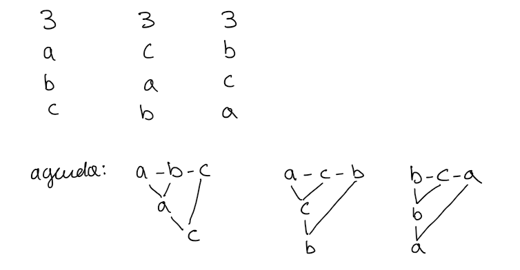

# Computational Social Choice - Part 2

***Example***

| 6    | 5    | 4    |
| ---- | ---- | ---- |
| milk | beer | wine |
| wine | wine | beer |
| beer | milk | milk |

***scoring rules***: rule that gives some points to each alternative according to the ranking related to each agent.
$$
>_\sim(s_1,s_2,...,s_m) \ \ \ \ \ \ \ \ m=|U| \ \ \ \ \ \ s_i\in \R
$$
where $s_i$ is the score of the $i$-th alternative in the ranking.
$$
s_1 \ge s_2 \ge... \ge s_m \ \ \ \ \ \ s_1 > s_m
$$

#### Scoring Rules

- <u>Plurality Voting</u>  
  Everyone votes for his preferred alternative. for example, milk gets 6 votes, beer 5 votes, and wine 4.  
  We are considering one point for each vote.  
  $(1,0,0,...,0)$ you consider the first ranked $\to$ milk
- <u>Borda Count</u>  
  $(m-1,m-2,...,0)$  
  $m =$  number of alternatives. 
  In our example we have:  
  milk: $6\cdot 2 + 5 \cdot 0 + 4 \cdot 0 = 12 	$  
  wine: $6 \cdot 1 + 5 \cdot 1 + 4 	\cdot 2	= 19$   
  beer: $6 \cdot 0 + 5 \cdot 2 + 4 \cdot 1= 14$. 
  shortly we have that the last position counts $0$, the second one counts $1$, and the first one counts $2$.

Which one between Borda and Plurality can be considered also social welfare function?  
Which means: which one will return a ranking?  
Borda returns a global ranking among preferences.

#### Pile Wise Majority Voting

A ***==Condorcet Winner==*** is an alternative that wins against every other alternative in a pile wise majority voting.   

***Pile wise majority voting***: a voting where you have only 2 alternatives and the alternative that gets more points is the winner. 

I suppose that in order to do a PWMV we need to consider the preference profile of the agents.

A Condorcet winner is a very strong candidate because he wins against every other candidate.

Do we have a Condorcet winner in the beverage example? (we are considering Borda count)

$milk - \color{red}beer $ 

$milk - \color{red}wine$

$\color{red}wine\color{black} - beer$

Yes: wine, because it wins against every other candidate.

A ***==Condorcet Extension==*** is a voting rule that selects a Condorcet winner if a Condorcet winner exists.  

It is not the case of plurality, it may be the case of Borda considering the result but it's actually not:  
No scoring rule is guaranteed to select the Condorcet winner if the Condorcet winner exists, no scoring rule is a Condorcet Extension.

*Example*

| 6    | 3    | 4    | 4    |
| ---- | ---- | ---- | ---- |
| a    | c    | b    | b    |
| b    | a    | a    | c    |
| c    | b    | c    | a    |

17 agents in total. 3 candidates.

is there any condorcet winner? (we are counting the number of times item $i$ is preferred over item $j$)

$\color{red} a \color{black} - b $ ($9$ over $8$)

 $\color{red} a \color{black} - c $ ($10$ over $7$) 

at this point we know $a$ is a condorcet winner.

 $\color{red} b \color{black} - c $ 

Let's see that no scoring rule would have selected $a$:

these are the generical weights associated with preference ranks: $(1,x,0)$

$a: 6\cdot 1+ 3 \cdot x +4 \cdot x + 4	\cdot 0=6+7x $  
$b:6\cdot x+ 3 \cdot 0 + +4 \cdot 1 + 4 \cdot 1 =8 + 6x$  
$c: 0+0+3+4 \cdot x= 3 +4x$

There is no legal (between $0$ and $1$) value of $x$ such that $6+7x>8+6x$, in fact we obtain that $x>2$ while we would like an $x$ such that $0<x<1$.

#### Copeland's Rule  

In order to determine the winner you give to each alternative one point every time it is winning against another alternative, you give $1/2$ when there is a tie, $0$ points when it loses.  
$a:2$  
$b:1$  
$c:0$  

#### Plurality with Runoff

So far we considered voting rules that have a single step.    
There are multi step voting rules:  
In voting rules that evolve in steps, the winner is found after several steps. An example is plurality with runoff:

***Plurality with Runoff***: typical in political elections.  
It is a 2 stage voting.  
In the first stage you run a plurality voting.  
Then you take the 2 most voted candidates and run a pairwise majority voting between the 2 (a ballot).

*Example*

| 6    | 5    | 4    |
| ---- | ---- | ---- |
| milk | beer | wine |
| wine | wine | beer |
| beer | milk | milk |

after $1^{st}$ stage:

| milk | beer |
| ---- | ---- |
| 6    | 5    |

after $2^{nd}$ stage:

beer wins over milk ($9$ over $6$):

Conclusion:

Beer wins.

#### Single Transferable Vote (STV)

Run a plurality voting, then the alternatives that are ranked first by the lowest number of agents are eliminated, then you run a new plurality voting without considering the eliminated candidates.  
$N$ candidates $\to$ $N-1$ round to perform. 

*Example*

| 6    | 5    | 4    |
| ---- | ---- | ---- |
| milk | beer | wine |
| wine | wine | beer |
| beer | milk | milk |

I eliminate wine.

| 6    | 5    | 4    |
| ---- | ---- | ---- |
| milk | beer | beer |
| beer | milk | milk |

beer wins over milk ($9$ over $6$):

I eliminate milk.

Beer wins.

Is it a condorcet winner extension? no.

It is not trivial to find a system that selects a good candidate.

#### Sequential Majority Voting

Combine in different ways a sequence of majority voting.

  

*Agenda* : the order in which alternatives are paired in a sequence of pair wise majority voting.

what we are saying in the second sequential majority voting example is:   
let's compare $a$  with $b$ first, and then let's compare the winner with the other one. according to different ways to start there are different final outcomes! So whenever someone says "let's start from evaluating those two" there is something wrong with this kind of reasoning.

According to how we select the agenda we have different winners.   
Selecting the agenda is
not neutral. 

==Sequential Majority Voting is a condorcet extension because the condorcet winner can never
lose in a pair wise comparison==.

#### Strategic Manipulation of vote

Let's consider that we have 4 candidates

| 1    | 2    | 2    | 2    |
| ---- | ---- | ---- | ---- |
| a    | a    | b    | c    |
| b    | c    | a    | b    |
| c    | b    | c    | d    |
| d    | d    | a    | a    |

I'm running plurality voting. who is the winner? candidate $a$ because he gets more votes.

Now let's suppose I'm one of the last two players (fourth column).   
I'm not happy with the outcomes.  
If I know the preference relation of the other candidates what can I do?  
I say: if I vote $c$ the winner bill be $a$. let's vote $b$, even if it is not my favorite candidate, but it will win, and I like him way more than $a$. This is called ***strategic manipulation***.

*any agent can report wrong information in order to get an advantage*

What happens if, in the same example, instead of using plurality voting we use Borda count?

$a: 9$  
$b: 14$  
$c: 13$  
$d: 6$

$b$ wins.

Also Borda count is prone to strategic manipulation...

==***Gibbard–Satterthwaite Theorem***==

*Any voting system is prone to strategic manipulation.*

So you can not avoid strategic manipulation, but you can make it harder to happen.

#### Probabilistic Voting Rule

So far we have considered deterministic voting systems. The winner is deterministically selected. It is also possible to use probabilistic voting rules:  
The rule is not selecting a candidate, but it is giving in output a probability distribution over the candidates. Then you pick up the winner randomly selecting the candidate according to the probability distribution.  
So, deterministic voting rule will output something like: the winner is $a$ with 100% probability.  
Probabilistic voting rules will output something like: the winner is $a$ with 70%, $b$ with 10% and so on.

==***Another Gibbard-Satterthwaite Theorem***==

*when*

- *there are more than 2 alternatives*
- *you use a probabilistic voting rule*
- *you impose that your probabilistic voting system is Pareto optimal*
- *and it is no manipulable*  

*then the only probabilistic voting system that is satisfying it is probabilistic dictatorship.*