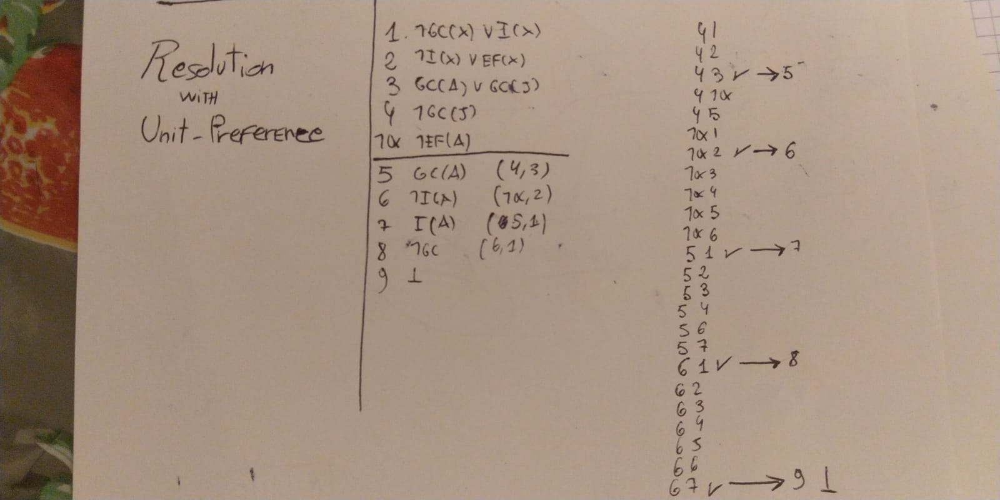
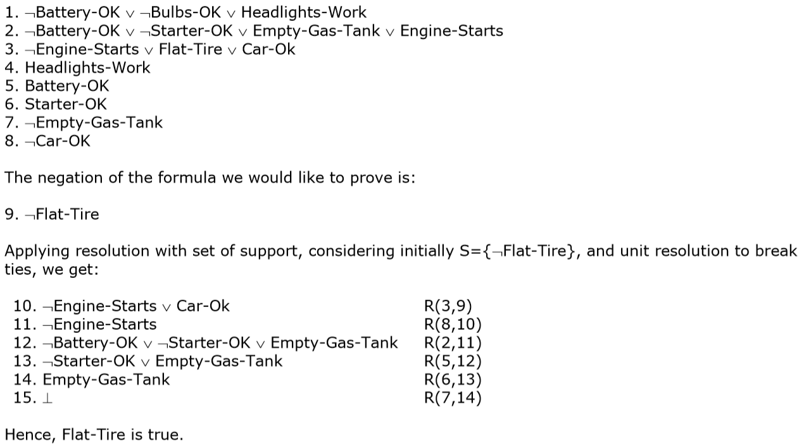

# Logic - Part 1

### Introductory Definitions

- *Arguments* 
  An argument is any set of statements - explicit or implicit - one of which is the conclusion (the statement being defended) and the others are the premises (statements providing the defense). The relationship between the conclusion and the premises is such that the conclusion follows from the premises.
- *Statement*
  A statement is any indicative sentence that is either true or false
- *Deductively Valid Argument*
  A deductively valid argument is an argument such that it is not possible both for its premises to be true and its conclusion to be false. In other terms, in a valid argument it is not possible that, if the premises are true, the conclusion is false.
- *Soundness*
  An argument can be deductively valid, but unlikely to persuade anyone. Normally good argument are not only deductively valid. They also have true premises. These arguments are called *sound*. For example, "All fish fly. Anything which flies talks. So, all fish talk" is a deductively valid argument but it's not sound.

### Propositional Logic

Propositional Logic is a branch of logic, and it can be thought as comprised of three components:

1. Syntax: which specifies how to build sentences
2. Semantics: which attaches to these sentences a meaning
3. Inference Rules: which manipulate these sentences to obtain more sentences

Before diving into it let's see an example of PL sentence:

${MotherAB \iff FemaleA \space \and ParentAB}$

**Syntax of PL**

It defines the allowable sentences in PL, which are:

- *Atomic Sentences*: indivisible syntactic elements consisting of a single propositional symbol, usually an upper case letter (P,Q,R). Every symbol represents a sentence that can be true or false.
- *Complex Sentences*: constructed from atomic ones by means of logical connectives (negation, conjunction, disjunction, conditional, biconditional).

**Semantics of PL**

The semantics defines the rules for determining the truth of a sentence  with respect to a particular model. The truth-value of complex sentences is established recursively, in accordance with the truth tables of the logical connectives (negation, conjunction, etc).

**Inference in PL**

Reasoning aims at getting new knowledge. New knowledge comes from getting new true sentences from other true sentences that are already in our KB.

**Definitions**

- *Model*
  In Propositional Logic, a model is an assignment of truth values to all propositional symbols.   
  Let us consider the following example. If in our ${KB}$ we make use of the proposition symbols ${P1, P2,P3}$, a possible model is ${M1 =\{ P1 = False, P2 = False, P3 = True\}}$.  

- *Satisfiability*
  a sentence is satisfiable if and only if there is a model that satisfies it. 
  A model satisfies a sentence if the sentence is true under the assignment. 

- *Logical Entailment*
  A set of sentences (called premises) *logically entail* a sentence (called a conclusion) if and only if every model that satisfies the premises also satisfies the conclusion.

- *Logical Inference*
  The action of obtaining new sentences from other sentences by applying inference rules. If the new sentence is implied by KB we can expand our KB with such sentence.

- *Soundness of an inference rule*
  An inference rule *i* is said to be sound when all inferred/derived sentences are also entailed.
  $$
  if\ \ \ \  (KB \vdash_i \alpha \ \and \ sound(i)=true)\ \ \ \  then \space\space\space\space (KB\ \models\ \alpha)
  $$

- *Completeness of an inference rule*
  An inference rule *i* is said to be complete if it can derive/infer all entailed sentences.

- *Set of inference rules I*  
  We may have a set of inference rules *I* instead of a single rule *i*.
  $$
  KB\ \vdash _I\ \alpha
  $$
  means that we obtain $\alpha$ from the sentences of $KB$ after applying some of the rules in $I$ a number of times.

- *Soundness & Completeness together*

  - If we have a sound and complete set of inference rules *I*, we may want to use it to check whether $KB \models \alpha$ or not, instead of constructing the truth table of all sentences in $KB$ and $\alpha$.
  - if *i* is not sound, 
    even if we get ${KB \space \vdash_i \alpha}$, we cannot be sure that ${KB \models \alpha}$ 
  - if *i* is not complete, 
    even if ${KB \models \alpha}$, we may not get to the result of having ${KB \vdash _i\alpha}$   

- *Logical Equivalence*
  Two sentences ${P_1}$ and ${P_2}$ are equivalent if they are true in the same set of models.
  We write ${P_1 \equiv P_2}$  

- *Validity*
  A sentence is valid if it is true in all models. A valid sentence is also called a tautology.

- *Deduction Theorem*
  For any sentence ${P_1}$ and ${P_2}$, ${P_1 \models P_2}$ if and only if ${P_1 \rightarrow P_2}$ is valid.

- *Satisfiability*
  A sentence is said to be satisfiable if it is true in some model.

- *Contradiction*
  An unsatisfiable sentence.

- *Inference Rules*
  We use inference rules to derive some conclusions from the sentences in our KB.

  - Resolution

    ${A \or B
    \\
    A \or \neg B
    \\
    \rule{2cm}{0.5mm}
    \\
    A \or A \space (with \space resolution) 
    \\
     \rule{2cm}{0.5mm} 
    \\
    A \space (with factoring)}$

    Resolution can be applied only to clauses

  - Modus Ponens

    ${\alpha\to\beta
     \\ 
     \alpha 
     \\ 
     \rule{2cm}{0.5mm} 
     \\ 
     \beta}$

  - Conjunction Elimination
    ${\alpha \and \beta 
    \\
    \rule{2cm}{0.5mm} 
    \\
    \alpha}$

  - Conjunction Introduction
    ${\alpha \\ \beta \\ \rule{2cm}{0.5mm}  \\ \alpha \and\beta}$

  - Disjunction Introduction
    ${\alpha
    \\
    \rule{2cm}{0.5mm} 
    \\
    \alpha\or\beta}$

  - All logical equivalences, for instance contraposition
    ${\alpha \rightarrow \beta \\ \rule{2cm}{0.5mm} 
    \\
    \neg\beta\to\neg\alpha}$

- *Monotonicity*
  A property of Propositional Logic that can be expressed in the following way:

  $${if \space\space KB\models\alpha\space\space\space\space then \space\space KB  \cup{\beta}\models\alpha }$$

  which means that if we expand the KB, we can have additional conclusions, but such expansion cannot invalidate a conclusion already inferred like ${\alpha}$.
  Monotonicity means that we can apply inference rules whenever suitable premises are found in the KB, regardless of what else is there.

#### Resolution

Resolution, as already said, is one of the many possible inference rules we can apply to our KB.
Now we'll get deep into Resolution Inference Procedure.
First of all, remember that resolution ==is not a complete inference procedure==, for example, ${A \or B}$ is a logical consequence of ${A}$, because it is true whenever ${A}$ is true, but such consequence cannot be obtained from ${A}$ by resolution.  
However there is a specific way to exploit resolution, in which some form of completeness hold. if we want to check whether ${A\or B}$ is a logical consequence of ${A}$ we take ${A}$ as hypothesis (that is, we suppose ${A}$ to be true). ${A \or B}$ becomes our thesis, we negate it, and we conjunct the hypothesis with the negated thesis. Such conjunction is not satisfiable if and only if the hypothesis and the negated thesis can never be true at the same time, that is, the thesis is a logical consequence of the hypothesis.  
When the search for the contradiction is performed by means of the resolution technique, we call it *refutation by resolution*.  
When we say that resolution is ==refutation complete==, we mean that this procedure always reaches a breakpoint (we obtain the empty clause, or we obtain no new clauses by applying resolution to all possible pairs of clauses from the KB).

**How to put a proposition in Conjunctive Normal Form**

1. Eliminate implications
2. Move not inwards
3. Standardize variables
4. Skolemize
5. Drop universal  quantifiers
6. Distribute OR over AND

**Algorithm**

solve
$$
\phi_1 \models \phi_2
$$

1. negate 

$$
\phi_2
$$

2. put both $\phi_1$ and $\neg\phi_2$ in Conjunctive Normal Form (all sub-formulas divided by a logical AND)
3. Enumerate all clauses
4. compare them together, if a literal appears in both clauses and in only one of them it is negated we get rid of it and write a new clause 
   Examples:
   - 1. ${A}$ 
     2. ${\neg A \or B}$ 
     3. ${B}$                          R (1,2) 
   - 1. ${\neg A \or \neg B}$
     2. ${A \or B}$ 
     3. ${\neg B \or B}$               R(1,2)
     4. ${\neg A \or A}$               R(1,2)
5. We do not write the new clause if it has already been written
6. the initial expression is true if in the end we obtain the empty clause

**Strategies for selecting clauses:**

- *Unit-preference strategy*

  **Definition**
  "Pairs in which one of the two formulas is a literal should be preferred. The basic idea is that, as we are looking for the empty clause, we have better focus on clauses that are already small".

  **Marco's quote** (*Marco è uscito con 110L dalla triennale, fidatevi di lui*) 
  "*Basta che ci sia sempre una clausola con un solo letterale.  
  Non credo importi l'ordine.   
  Io infatti vado sempre a sentimento cercando di scegliere quelle che mi fanno finire prima*"

  **Gne Procedure **  
  The order in which you compare the clauses can be random, though if you want to make sure to compare all the clauses with each other it's better to follow a procedure (sometimes it can be time consuming). The procedure followed during the correction is probably the following:  
  Give preference to resolutions involving the clauses with the smallest number of literals.
  In depth: Consider the first clause of your KB with the smallest number of literals and compare it with all of the others starting from the first one and going orderly until the end (compare it even with the derivations you obtained in itinere!).  

  Once you are done comparing such clause, repeat the algorithm with the following clause with the smallest number of literals.  

  This procedure can be misleading since if there were clauses with more than 2 literals, we should start comparing the one literals with the two-literals clauses, and 

  **Example**  
  

  **CounterExample**

  # 

  

- *Set-of-support resolution*

- Solve the problem by using always at least one element of the set of support or its derivations.
  Does not guarantee completeness.

- *Input resolution*
  Solve the problem by using always at least one of the input propositions, the negated thesis included.
  Does not guarantee completeness.

- *Subsumption* 
  Eliminates all sentences that are subsumed (i.e., more specific than) an existing sentence in the KB.

