# Convolutional Neural Networks 

### **Convolution and correlation, linear classifier for images**

the correlation among a filter $h$ and an image is defined as  $I(r,c) \otimes h  =\sum_{v=-L}^{L}\sum_{u=-L}^Lh(u,v)I(r+v,c+u)$

Convolution is just like correlation, except that we flip over the filter before correlating. 

convolution is a function $I(r,c) * h  =\sum_{v=-L}^{L}\sum_{u=-L}^LI(r-v,c-u)h(u,v)$

the key difference between the two is that convolution is associative.

in general, people use convolution for image processing operations such as smoothing, and they use correlation to match a template to an image.

$\color{red}\text{normalization problem, to be understood completely}$.

A linear classifier is a function $f:\R^{n\cdot m\cdot 3}\to \R^l$, or $f:\R^{n\times m}\to \R^l$ that given an image as input it returns a vector of scores. the vector length $l$  denotes the number of classes of the classification problem and the $i $-th element denotes the score of the $i$-th class. the basic idea is that the element with the highest score should correspond to the target class, so such class is the returned predicted class.

the function is to be seen as $f=Wx+b$ where, in the RGB version:

- $W$ is the weights' matrix $l\times (n\cdot m\cdot 3)$(each line of the matrix tells you the importance of each pixel of the input image for the class correspondent to such line).
- $x$ is the input image written column-wise, $(n \cdot m \cdot 3)\times 1$
- $b$ is a bias vector $l\times1$

each line of $W$ can be seen as a template to be matched against the input image. the vector returns the score of the matchings.  

image classifiers are not good for generalization: they could learn a template for a class highly correlated with the the training data and have poor results when given a test image with some basic transformations, or with high inter-class variability.

we could talk about the geometric interpretation as well, and about the loss function to be minimized.

### The layers of a CNN 

convolution, activation, pooling, fully connected.

### Connections between CNN and Feedforward-NN, interpretations of CNN

first part to extract features. second part to learn relationships among features, it is meant to solve the specific task at hand.

### How to compute the number of parameters of a CNN

I know how to do it.

### Best practices to train CNN models: data augmentation, Transfer learning

data augmentation can be done via

- geometric transformations
  - shifts/rotation/perspective distortions
  - shear
  - scaling
  - flip
- photometric transformations
  - adding noise
  - modifying average intensity
  - superimposing other images
  - modifying image contrast

augmentation can help with class imbalance and data scarcity (obviously).

Transfer learning has already been described previously. it is a good option when little training data are provided and the pretrained model is expected to match the problem at hand.

### Design criteria from the most successful architectures shown during classes (no need to know exactly the architectures)

==LeNet-5==

- idea of using a sequence of $3$ layers: convolution, non linearity, pooling, as we do today.
- average pooling
- non linearities: tanh or sigmoid
- MLP as classifier for the final layer

==AlexNet==

- 5 convolutional layers with filters 11x11 and 5x5
- 3 MLP
- introduced
  - ReLu
  - Dropout, weight decay, norm layers
  - MaxPooling

==VGG16==

- deeper variant of AlexNet with smaller filters.

- winner of localization an classification in ImageNet 2014

- the paper presents a study on the role of network depth: fix other parameters of the architecture, and steadily increase the depth of the network by adding more convolutional layers, which is feasible due to the use of very small $3 \times 3$ convolution filters in all layers.

- multiple $3 \times 3$ convolutions in a sequence achieve a larger receptive field with 

  - less parameters
  - more non linearities

  

==GoogLeNet==

- at the beginning there are two blocks of conv + pool layers.
- then there are a stack of 9 ==inception modules==.
- it has some mid classifiers (for dying neuron problem)
- no fully connected in the end! simple averaging pooling, linear classifier + softmax.

***Inception Module***

- choosing the right kernel size for the convolution is difficult because images could show interesting features at different scales.

- moreover, deep networks tend to over fit and to become very computationally expensive.

- the solution is to exploit multiple filter size at the same level and then merge the output activation maps together.

- it is a module that performs in parallel 1x1, 3x3, 5x5 convolutions and a final pooling in order to avoid the problem of choosing the kernel size.  

- To decrease the computational load of the network we have a filter 1x1 added before the 3x3 and 5x5 convolutions.  
  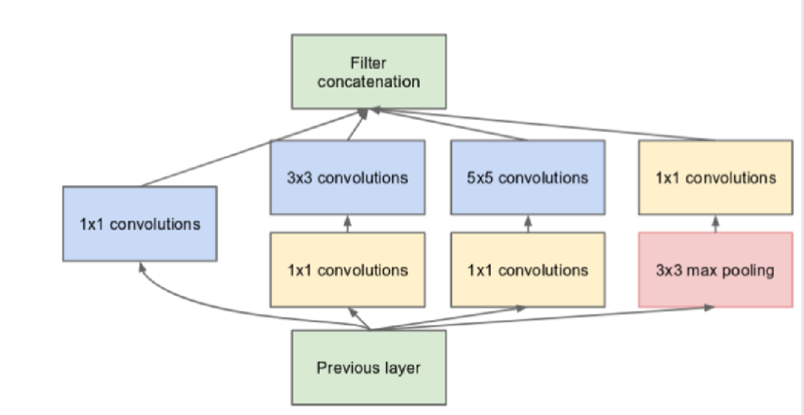

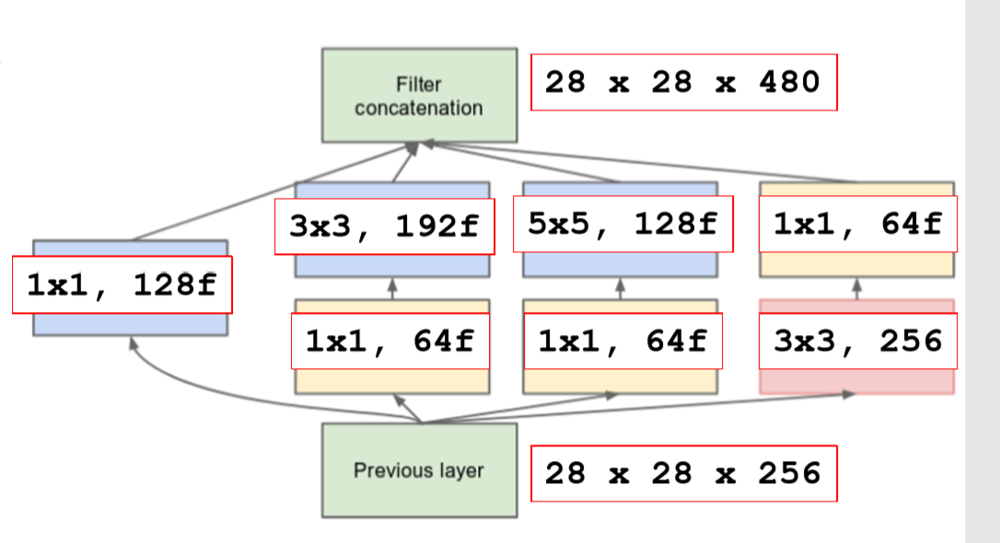

==ResNet==

- very deep network: 152 layers
- rationale:
  - deeper model are harder to optimize than shallower models (vanishing gradient)
  - we might in principle copy the parameters of the shallow network in the deeper  one, and then, in the remaining part, set the weights to the identity.
  - learn residuals
  - in the end no FC ,just a GAP to be fed in the final softmax

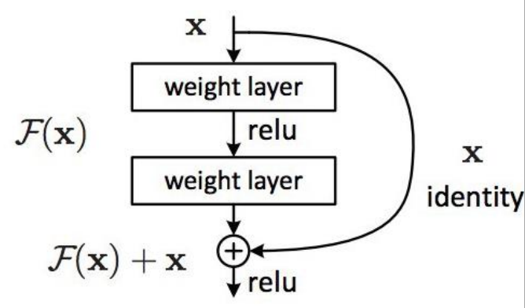

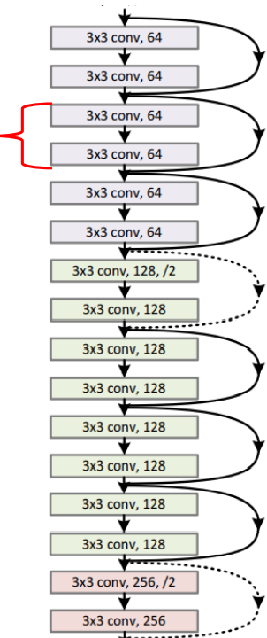

==ResNeXt==

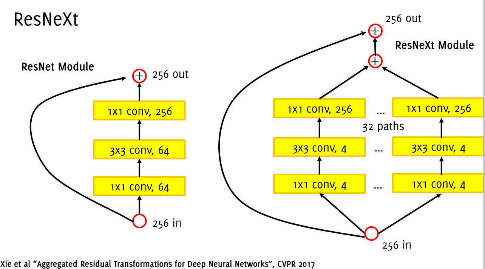

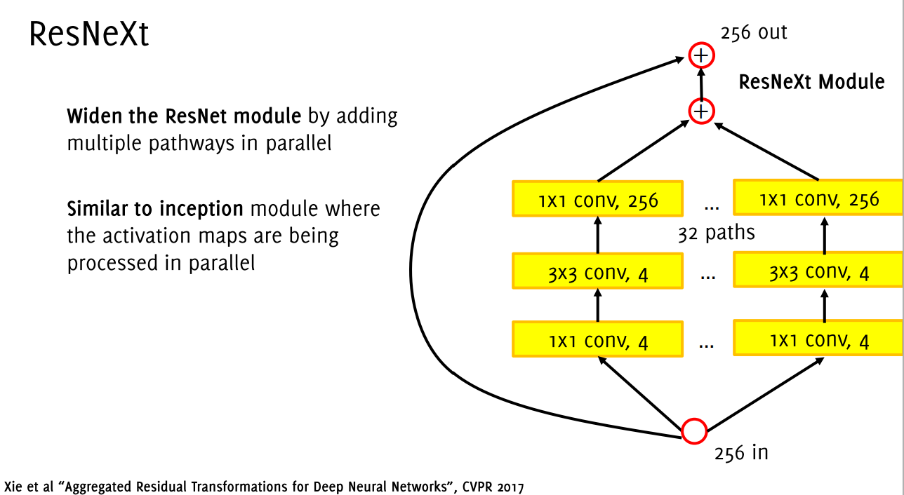

==DenseNet==

- each convolutional layer takes as input the output of the previous layers
- this alleviates the vanishing gradient problem
- promotes feature re-use since each feature is spread through the network
- made up of many dense blocks:

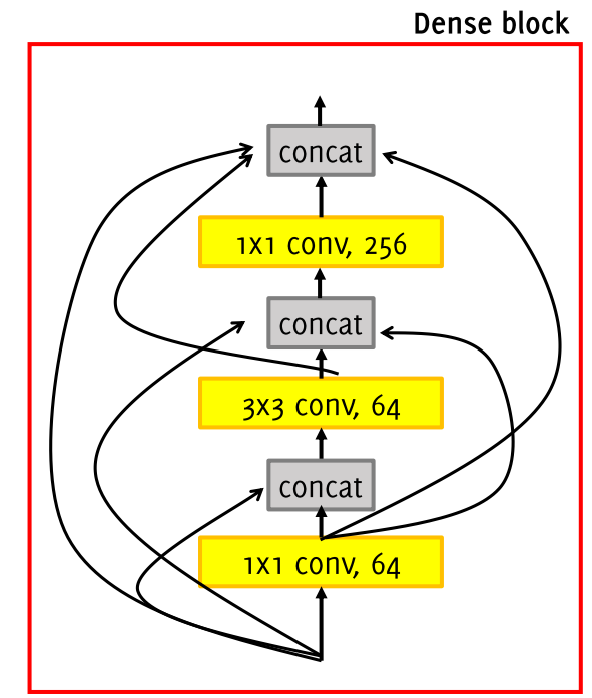

### Fully convolutional CNN 

in normal CNNs the FC layer constrains the input to a fixed size.  
==Since the FC is linear, it can be represented as convolution!==

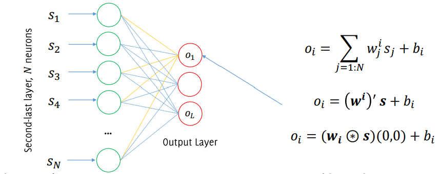

==A FC layer of L outputs is a 2DConv Layer against L filters of size $1\times1 \times N$==

Each of these convolutional filters contains the weights of the FC for the corresponding output neuron.

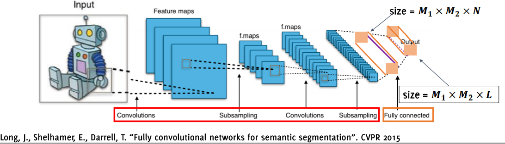

FCCNNs output, for each class:

- a lower resolution image than the input image
- class probabilities for the receptive filed of each pixel

the outputs of a Fully Convolutional are heatmaps!

### CNN for segmentation

*Semantic Segmentation, possible solutions*

<u>Direct Heatmap</u>

- assign the highest predicted class in the heatmaps to the whole receptive field of the input image $\to $ very coarse estimate.  
  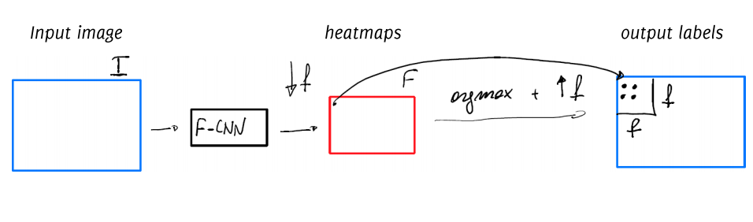

<u>Shift and Stitch</u>

- compute the class as in direct heatmap but stitch the predictions obtained by giving as input shifts of the input image  
  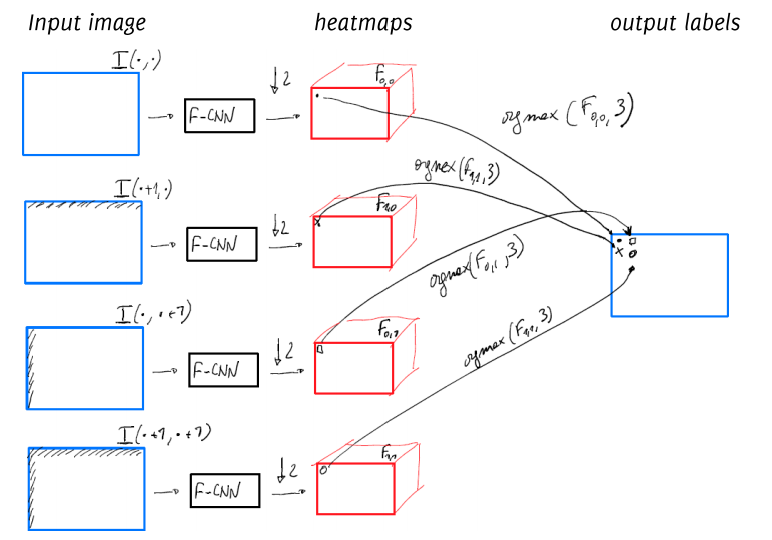

<u>Only convolutions with no pooling</u>

- very inefficient

***Problems of the approaches above***

on one hand we need to go deep to extract high level information on the image, but on the other end we want to stay local not to lose spatial information.  
We need both worlds to communicate better.

***Let's solve it***

We should use an architecture like the following:

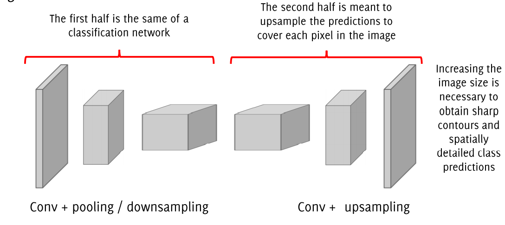

***How to perform upsampling?***

- nearest neighbor $\to$ coarse

- bed of nails $\to$ coarse

- max unpooling (remember which element was max)

- transpose convolution   $\to$ if ALONE it's coarse, but we are getting to the solution

  - they can be seen as a traditional convolution after having upsampled the input image
  - filters can be learned, so it gives us freedom!  
    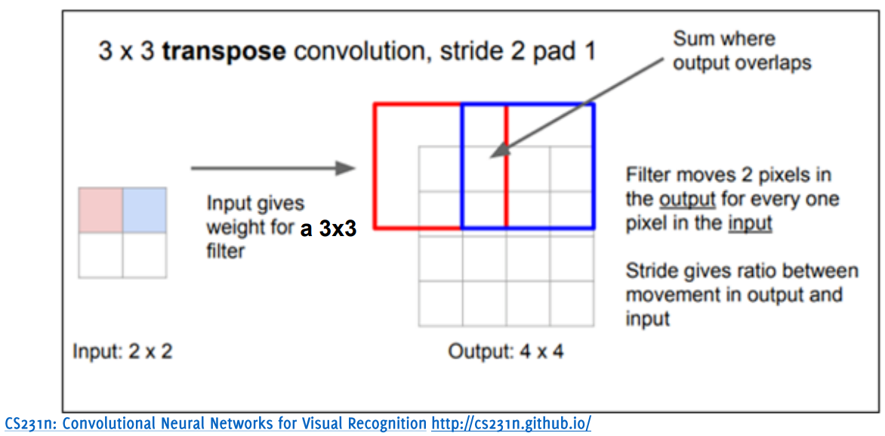

  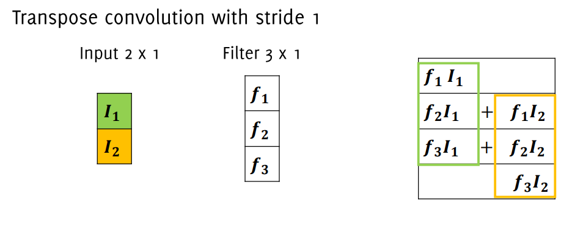  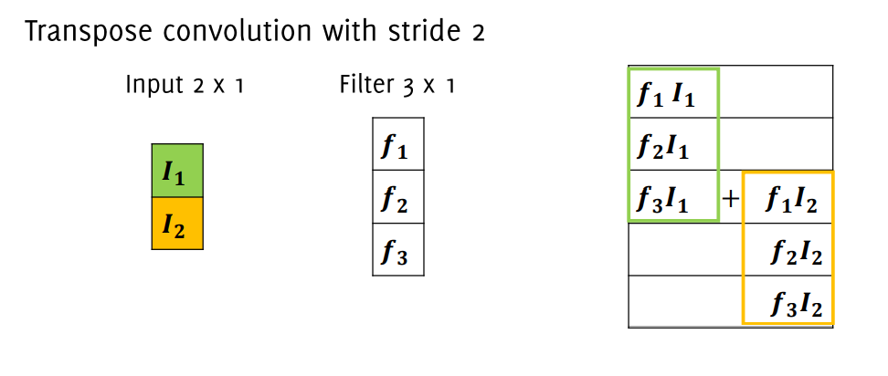

***Solution! :***

<u>Concept -  Skip Connections</u>

- combining fine layers and coarse layers lets the model make local prediction that respect global structure
- aggregation through summation  
  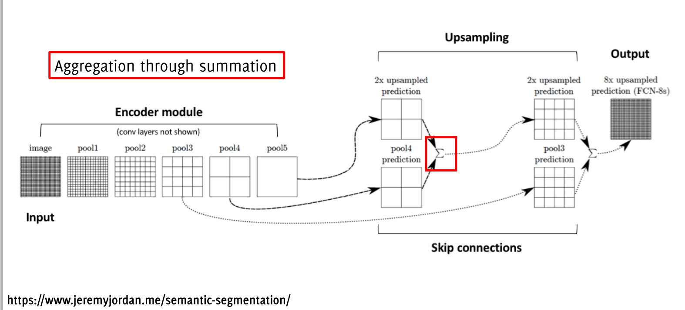  
    this image should sum it up: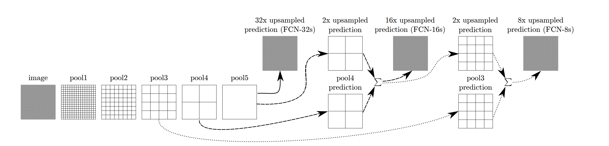  
  taken directly from the paper "Fully Convolutional CNNs for semantic segmentation"

<u>U-Net</u>  

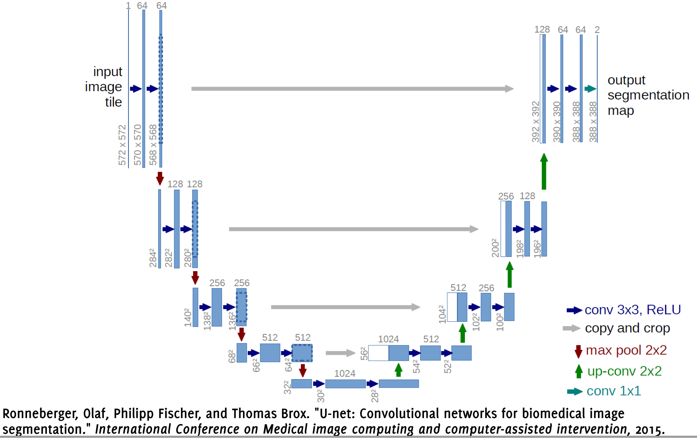

- a network formed by 

  - a contracting path
  - an expansive path

- uses a large number of features channels in the upsampling part.

- use excessive data-augmentation by applying elastic deformations to the training images

- ***Contracting Path***, at each downsampling, repeat blocks of

  - $3 \times 3$ convolution + ReLu
  - $3 \times 3$ convolution + ReLu
  - $2 \times 2$ max pooling

- ***Expansive Path***

  - $2 \times 2$ transpose convolutions
  - concatenation of corresponding cropped features
  - $3 \times 3$ convolution + ReLu
  - $3 \times 3$ convolution + ReLu

- ==aggregation through concatenation==

- full image training by a weighted loss function  $\hat{\theta}=\min \sum_{x_j}w(x_j)l(x_j, \theta)$  
  where 

  - $w(\bold{x})=w_c(\bold{x})+w_0e^{-\frac{(d_1(\bold{x})+d_2(\bold{x}))^2}{2 \sigma^2}}$
  - $w_c$ is used to balance class proportions
  - $d_1$ is the distance to the border of the closest cell
  - $d_2$ is the distance to the border of the second closest cell
  - the second term is used to enhance performance at objects' borders!

  

<u>FCNN training options:</u>

- patch based
- full-image
  - fcnn are trained in an end-to-end manner
  - no need to pass through a classification network
  - takes advantage of FCNN efficiency, does not have to re-compute convolutional features in overlapping regions.

one example of architecture for segmentation is the NiN architecture (Network in Network)

<u>Network in Network</u>

- a few layers of
  - MLP conv layers (RELU) + dropout
  - Max Pooling
- GAP layer
- Softmax

What is Gap?

- compute the average of each feature map

the GAP strategy is:

- remove the fully connected layer at the end of the network
- predict by a simple softmax after the GAP
- watch out: the number of feature maps has to be equal to the number of output classes.

Pros?

- simple, not so prone to overfitting
- more interpretability

### The key principles of CNN used for object detection

for object localization we have GAP and a FC afterwards (CAMs).

SO GET JUST A LITTLE MORE INFO ON GAP PLEAAASE. DOES IT ACTUALLY O AN AVERAGE OR NOT? JUDGING BY THE LAST SLIDES I'VE SEEN, THERE IS NO AVERAGE, WEEEIRD.

***Object Detection***

given a fixed set of categories and an input image which contains an unknown and varying number of object instances, a training set of annotated images with labels and bounding boxes for each object is required.

***straightforward solution***

slide on the image a window of a known size and classify each region (the input in the center of the window is classified with such class).

it is very inefficient because 

- you need to run the classification for each slice of the image and
- you have to create the background class as well.
- how to choose crop size?
- huge number of crops
- difficult to detect objects at different scales

***Region Proposal***

region proposal algorithms are meant to identify bounding boxes that correspond to a candidate object in the image. 

the idea is to 

- apply a region proposal algorithm
- classify by a CNN the image inside each proposal region

examples of this algorithm:

***R-CNN***

1. consider the input image
2. extract region proposals ($\sim 2k$) 
3. merge them in a hierarchical fashion
4. each region proposal, properly resized, is fed to a CNN that computes a 4096 deep feature vector 
5. the features vector is fed into 
   1. multiple SVM classifiers to identify class
   2. a linear regressor to adapt shape of bounding box

***Fast R-CNN***  

*reduces time consumption*

1. the whole image is fed to a CNN that extracts feature maps
2. Regions of Interest (ROI) are directly cropped from the feature maps with a selective search
3. fixed size is still required to feed data to a fully connected layer. ROI pooling layers extract a feature vector of fixed size from each region proposal. 
4. each RoI layer feeds fully-connected layers creating feature vectors
5. the FC layers estimate both classes and BB location. a convex combination of the two is used as a multitask loss to be optimized (as in R-CNN, but no SVM here).

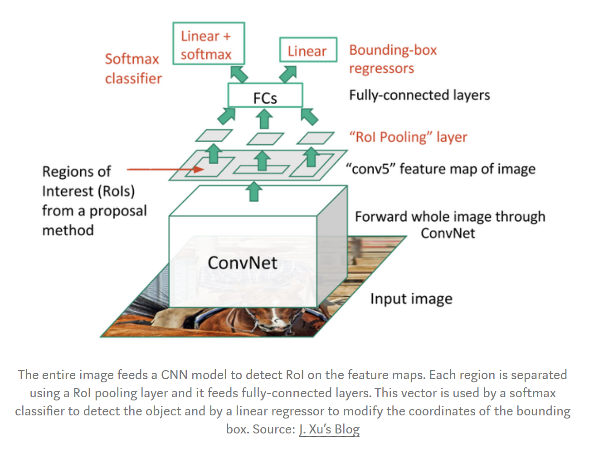

***Faster R-CNN***    

*no selective search anymore $\to$ introduced RPN (region proposal networks) to directly generate region proposals, predict bounding boxes and detect objects*

*combination between RPN and Fast-RCNN*

1. first stage
   1. run a backbone network (e.g. VGG16) to extract features
   2. run the Region Proposal Network to estimate $\sim 300 \  ROI$
2. second stage (the same as in Fast R-CNN)
   1. crop features through ROI pooling (with alignment)
   2. predict object class using FC + SoftMax
   3. predict bounding box offset to improve localization using FC + SoftMax

***YOLO***  

1. divide the image in a coarse grid (e.g. 7x7)

2. each grid cell contains $B$ base-bounding boxes associated

3. for each cell and base bounding box we want to predict

   1. the offset of the base bounding, to better match the object (dx, dy, dh, dw, objectness_score)
   2. the classification score of the base-bounding box over the $C$ considered categories (including background)

   so the output of the network has dimension $7\times 7 \times B \times (5+C)$

- rationale: region-based methods make it necessary to have two steps during inference. in YOLO "we reframe the object detection as a single regression problem. straight from image pixels to bounding box coordinates and class probabilities" and solve these regression problems all at once, with a large CNN
- the whole prediction is performed in a single forward pass over the image, by a single convolutional network
- 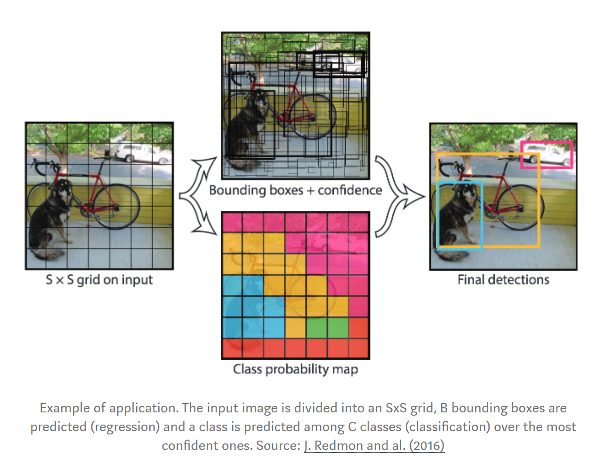

https://medium.com/zylapp/review-of-deep-learning-algorithms-for-object-detection-c1f3d437b852

___|||||||||||||||___ ||||

***Instance Segmentation***

it combines the challenges of

- object detection (multiple instances present in the image)
- semantic segmentation (associate a label to each pixel) separating object instances

***Mask R-CNN***

As in *Fast R-CNN* classify the whole ROI (Region Of Interest) and regress the bounding box (possibly estimate pose).

Mask is estimated for each ROI and each class.

then he starts talking about Inception, GoogLeNet, ResNet and friends... what are they actually for?

### ==Residual learning==

already written.

### ==GANs, what they are and how they are trained==

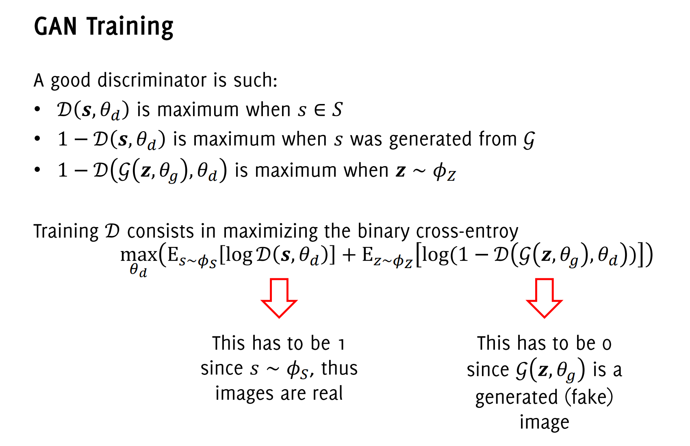

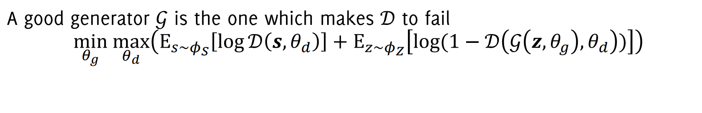

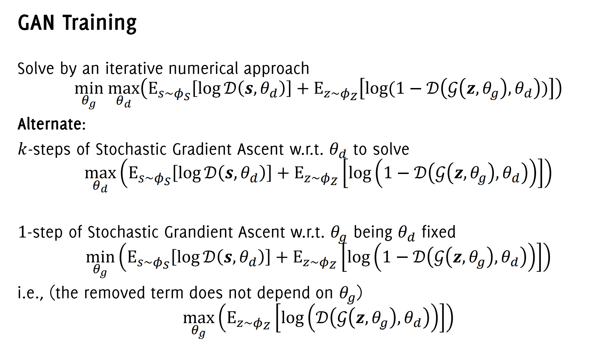

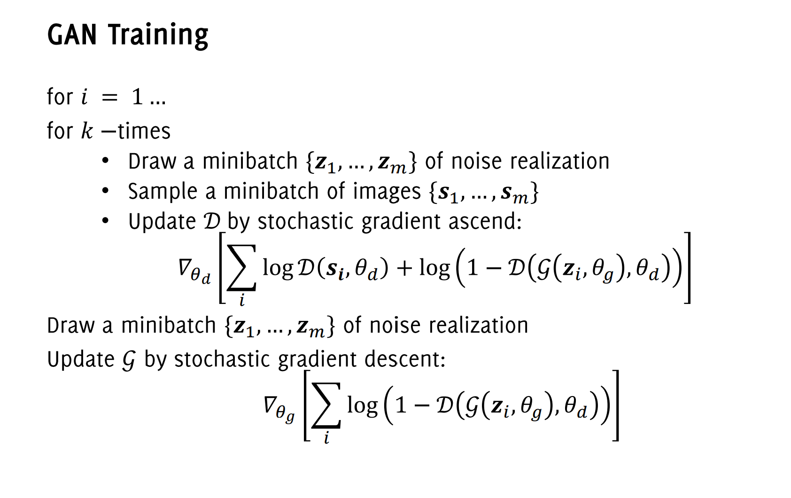

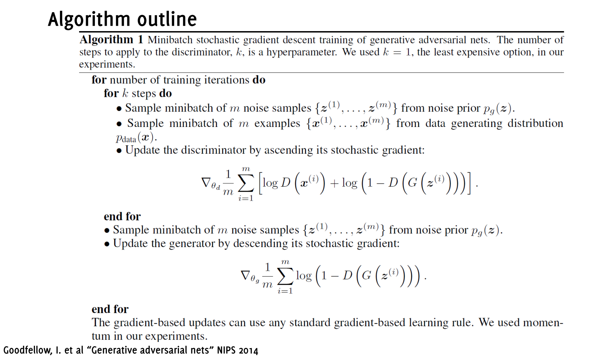

### **image processing tasks (optional)**

- image classification
- localization
- object detection
  - given a fixed set of categories and an input image which contains an unknown and varying number of instances, draw a bounding box on each object instance
- semantic segmentation
  - given an image $I$, associate to each pixel $(r,c)$ a label from a set of labels
  - does not separate different instances belonging to the same class
- instance segmentation
  - same as above, but distinguishes among different instances

### **image processing challenges (optional)**

- dimensionality
- label ambiguity
- transformations (illumination, deformations, view point change, occlusion...)
- inter-class variability
- perceptual similarity (pixelwise distance among original image and many image transformations could be same, but perception very different)

