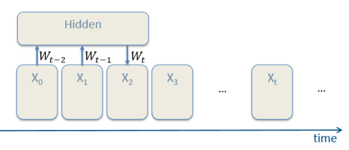

# Recurrent Neural Networks

#### Models for sequence modeling

Different ways to deal with «dynamic» data:

- Memoryless models

  - <u>Autoregressive models</u>  
    they predict the next input based on previous ones  
        
  - <u>Feedforward neural networks</u>  
    they generalize the autoregressive models using non linear hidden layers.  
      

- Models with memory:

  - <u>Linear dynamical systems</u>  
      

  - <u>Hidden Markov models</u>  

  - <u>Recurrent Neural Networks</u>

### The architecture and math of a recurrent neural network

In RNNs we deal with the time dimension as well.  
We have $I$ input neurons, and $B$ input recurrent neurons that represent the state of the system at previous timesteps. Let's suppose to have the following architecture (image to be uploaded).

w can say that $g(x_n|...)=...$

RNNs are models used for sequence modeling and they are able to have memory of the past (FFNN can't). RNNs have been used for text generation and similar things involving word sequences.

 Distributed hidden state allows to store information efficiently.  

### Backpropagation through time rationale and math

- perform network unroll for U steps
- initialize $V,V_B$ replicas to be the same
- compute gradients and update replicas with the average of their gradients

$V=V - \eta \frac{1}{U}\sum_{u=0}^{U-1}V^{t-u}$

$V_B=V_B-\eta \frac{1}{U}\sum_{u=0}^{U-1}V_B^{t-u}$ 

*explained better:*

Backpropagation Through Time, or BPTT, is the application of the Backpropagation training algorithm to recurrent neural network applied to sequence data like a time series.

A recurrent neural network is shown one input each timestep and predicts one output.

Conceptually, BPTT works by unrolling all input timesteps. Each timestep has one input timestep, one copy of the network, and one output. Errors are then calculated and accumulated for each timestep. The network is rolled back up and the weights are updated.

Spatially, each timestep of the unrolled recurrent neural network may be seen as an additional layer given the order dependence of the problem and the internal state from the previous timestep is taken as an input on the subsequent timestep.

We can summarize the algorithm as follows:

1. Present a sequence of timesteps of input and output pairs to the network.
2. Unroll the network then calculate and accumulate errors across each timestep.
3. Roll-up the network and update weights.
4. Repeat.

BPTT can be computationally expensive as the number of timesteps increases.

If input sequences are comprised of thousands of timesteps, then this will be the number of derivatives required for a single update weight update.  
This can cause weights to vanish or explode (go to zero or overflow) and make slow learning and model skill noisy ([source](https://machinelearningmastery.com/gentle-introduction-backpropagation-time/))

### The limits of backpropagation through time and the vanishing/exploding gradient issue

backpropagation through time becomes difficult to deal with when we want to consider a huge number of preceding timesteps. this is due to the fact that when we compute the gradient of the error function with respect to each weight, we obtain very small numbers due to the multiplication of many small partial derivatives.   
As we have seen for FFNN, the vanishing/exploding gradient issue happens when the NN is very deep. Whenever we consider too many timestep in the past we obtain a proportionally deep unrolled RNN.

### The vanishing gradient math in a simple case

to better understand the problem let's consider the following simple RNN

### The Long Short-Term Memory model, rationale, and math

rationale: we want to be able to read on, write in and forget a memory state based on an input and not on every step. to achieve this we introduced gates, which are trainable parameters: the network learns based on the input when to open and close these gates (when to read from its memory, update it with the new input, or forget it and replace it with the input).

### The Gated Recurrent Unit

### LSTM Networks, hierarchical and bidirectional. 

***purposes***

***Hierarchical and Bidirectional***

