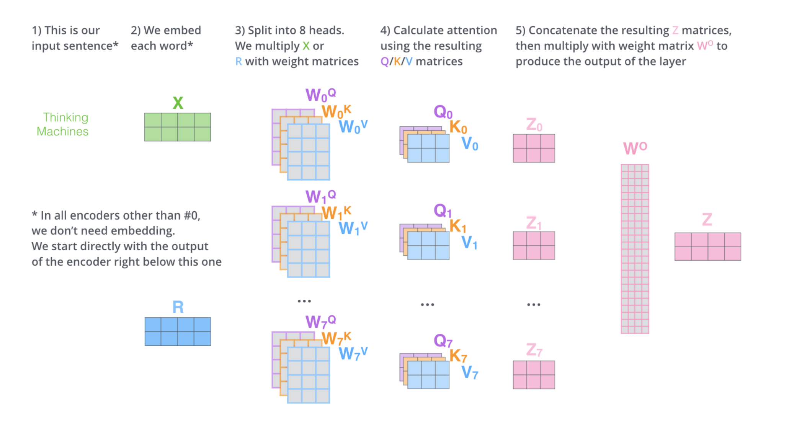

# Sequence to Sequence Learning

#### Sequential Data Problems, with examples

all the one/many to one/many problems

#### The Seq2Seq model, training, and inference 

you just need to remember picture.

#### Neural Turing Machine model and the attention mechanism

combine RNN  with an external memory bank.

we introduce with them the concept of attention $\to$ every step read and write everywhere at different extent.

#### Attention mechanism in Seq2Seq models 

draw the diagram of the seq2seq model. 

add drawing on probability distribution, context vector, and combine context vector with hidden state of target.

list the 4 steps to compute the attention vector for a specific target.

#### Chatbot: core models and context handling 

<u>Core Models</u>

- Generative  
  encode the question into a context vector and generate the answer word by word using conditioned probability distribution over answer’s vocabulary. E.g., an encoder-decoder model.
- Retrieval  
  rely on knowledge base of question-answer pairs. When a new question comes in, inference phase encodes it in a context vector and by using similarity measure retrieves the top-k neighbor knowledge base items. 

<u>Context Handling</u>

- Single-turn  
  build the input vector by considering the incoming question. They may lose important information about the history of the conversation and generate irrelevant responses.
- Multi-turn  
  the input vector is built by considering a multi-turn conversational context, containing also incoming question. 

#### The Transformer model  

- describe what it is 
- describe high level architecture
- each encoder has self-attention + ffnn
- each decoder has self-attention + encoder-decoder attention + ffnn
- a transformer model is made out of (rebus)

talk about 

- input
- self attention
- encoder-decoder attention

*Self Attention*

- say we decompose each word in 3 vectors: query, key, value

$$
\text{Attention}(Q,K,V)=\text{Softmax}\bigg(\frac{Q\cdot K^T} {\sqrt{d_k}}\bigg)\cdot V
$$

- say that  the NN can compute outputs in parallel

