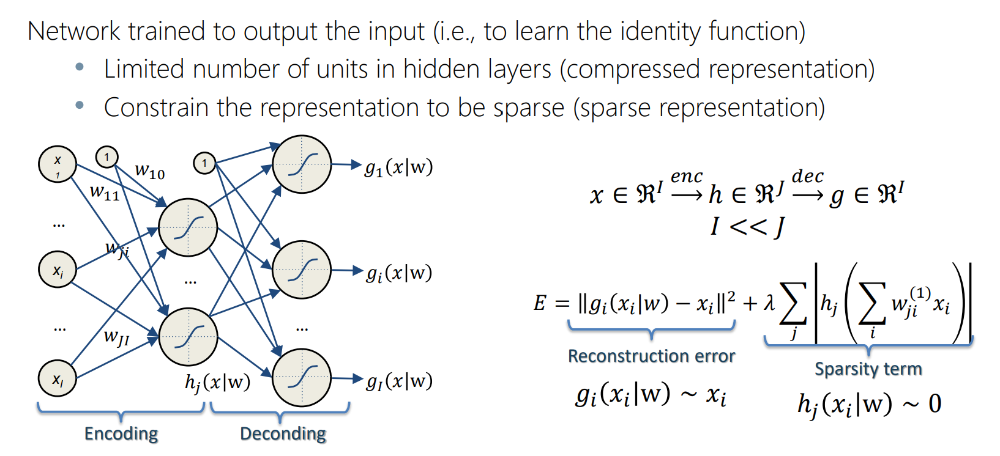
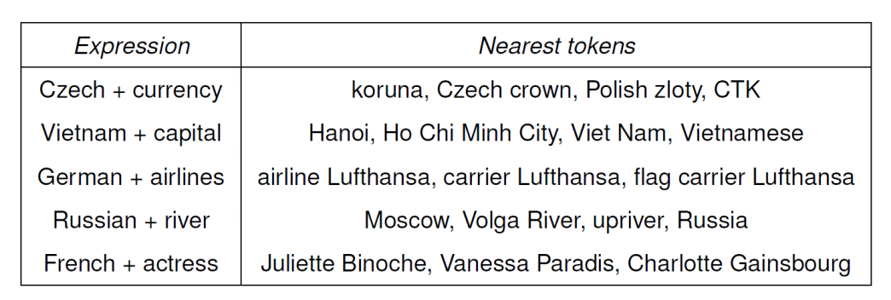
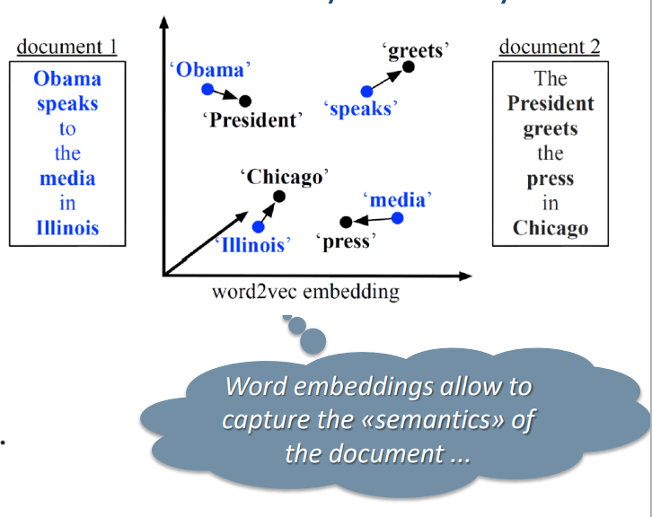

# Word Embedding 

#### Neural Autoencoder model, error function, and training

#### Language models and the N-grams model

- language models? don't know, talk a little about bag of words if you want

<u>N Grams</u>

- trigrams account for the last 2 words to predict the next word
- formula here
- problem: curse of dimensionality because we encode them with bag of words? gne don't know.

#### Limits of the N-gram model

#### The concept of embedding and its benefits

#### The Neural Language Model and its use for word embedding

#### Google’s word2vec model (CBOW)

#### Possible uses of word embedding

- <u>information retrieval</u>

  - query: restaurants in mountain view that are not very good
  - phrases: restaurants in (mountain view) that (not very good)
  - vectors: "restaurants+in+(mountain view)+that+are+(not very good)"  

  

- <u>document classification /similarity</u> 
  

- <u>Sentiment Analysis</u>

  - no need for classifiers, just use cosine distance

