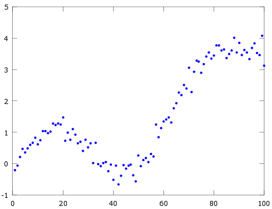
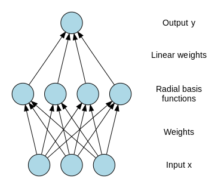
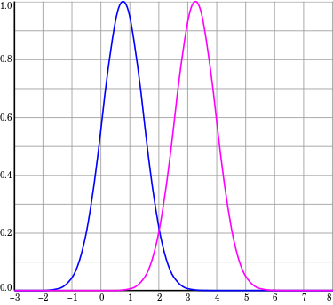
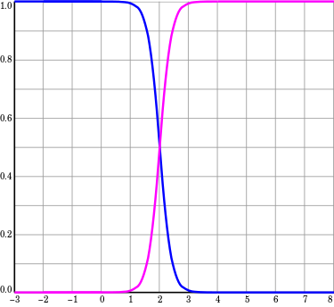

# Kernels

***Describe the purpose of using kernels in Machine Learning techniques. How can you construct a valid Kernel? Provide an example of a ML method using kernels and describe the specific advantage of using them for this method.***

Traditionally, theory and algorithms of machine learning and statistics have been very well developed for the linear case. Real world data analysis problems, on the other hand, often require nonlinear methods to detect the kind of dependencies that allow successful prediction of properties of interest. By using a positive definite kernel, one can sometimes have the best of both worlds. The kernel corresponds to a dot product in a (*usually high-dimensional, possibly infinite*) feature space. In this space, our estimation methods are linear, but as long as we can formulate everything in terms of kernel evaluations, we never explicitly have to compute in the high dimensional feature space! (This is called the *Kernel Trick*)

Suppose we have a mapping $\varphi : \R^d \to \R^m$ that brings our vectors in to some feature space $\R^m$. Then the dot product of $\textbf{x}$ and $\textbf{y}$ in this space is $\varphi (\textbf{x})^T\varphi (\textbf{y})$. A kernel is a function $k$ that corresponds to this dot product, i.e. $k(\textbf{x},\textbf{y})=\varphi (\textbf{x})^T\varphi (\textbf{y}) $ . Why is this useful? *Kernels* give a way to compute dot products in some feature space without even knowing what this space is and what is $\varphi$ . For example, consider a simple polynomial kernel $k(\textbf{x},\textbf{y})=(1+\textbf{x}^T\textbf{y})^2$ with $\textbf{x},\textbf{y} \in \R^2$. This doesn't seem to correspond to any mapping function $\varphi$ ,  it's just a function that returns a real number. Assuming that $\textbf{x} = (x_1,x_2)$ and $\textbf{y} = (y_1,y_2)$, let's expand this expression:
$$
k(\textbf{x},\textbf{y})=(1+\textbf{x}^T\textbf{y})^2 = (1+x_1y_1 + x_2y_2)^2=\\1+x_1^2y_1^2+x_2^2y_2^2+2x_1y_1+2x_2y_2+2x_1x_2y_1y_2
$$
Note that this is nothing else but a dot product between two vectors $(1, x_1^2, x_2^2, \sqrt{2} x_1, \sqrt{2} x_2, \sqrt{2} x_1 x_2)$ and $(1, y_1^2, y_2^2, \sqrt{2} y_1, \sqrt{2} y_2, \sqrt{2} y_1 y_2)$ and $\varphi(\mathbf x) = \varphi(x_1, x_2) = (1, x_1^2, x_2^2, \sqrt{2} x_1, \sqrt{2} x_2, \sqrt{2} x_1 x_2)$.

So the kernel $k(\mathbf x, \mathbf y) = (1 + \mathbf x^T \mathbf y)^2 = \varphi(\mathbf x)^T \varphi(\mathbf y)$ computes a dot product in 6-dimensional space without explicitly visiting this space.

Another example is the Gaussian kernel $k(\mathbf x, \mathbf y) = \exp\big(- \gamma \, \|\mathbf x - \mathbf y\|^2 \big)$. If we Taylor-expand this function, we'll see that it corresponds to an infinite-dimensional codomain of $\varphi$.

Instead, the simplest *kernel* is the *linear kernel* which corresponds to an *identity mapping* in the feature space: $k(\mathbf{x},\mathbf{x'}) = \varphi(\mathbf{x})^T\varphi(\mathbf{x'}) = \mathbf{x}^T\mathbf{x}$ 

Moreover, the *kernel* is a *symmetric* function of its arguments: $k(\mathbf{x},\mathbf{x'}) = k(\mathbf{x'},\mathbf{x})$

------

Many linear models for regression and classification can be reformulated in terms of *dual representation* in which the *kernel function arises naturally* ! For example if we consider a linear regression model we know that we obtain the best parameters by minimizing the *regularized sum of squares* error function (*ridge*):
$$
L_{\mathbf{w}} = \frac{1}{2}\sum_{n=1}^{N}(\mathbf{w}^T\varphi(\mathbf{x_n})-t_n)^2+\frac{\lambda}{2}\mathbf{w}^T\mathbf{w}
$$
Setting the gradient of $L_{\mathbf{w}}$ w.r.t $\mathbf{w}$ equal to $0$ we obtain the following:
$$
\mathbf{w} = -\frac{1}{\lambda}\sum_{n=1}^{N}(\mathbf{w}^T\varphi(\mathbf{x_n})-t_n)\varphi(\mathbf{x_n}) = \sum_{n=1}^Na_n\varphi(\mathbf{x}_n)=\Phi^T\mathbf{a}
$$
Where $\Phi$ is the design matrix whose $n^{th}$ row is $\varphi(\mathbf{x}_n)^T$ (remember that in $L_{\mathbf{w}}$ all the vectors are *column* vectors!) and the coefficients $a_n$ are functions of $\mathbf{w}$. So our definition of $\mathbf{w}$ is function of $\mathbf{w}$ itself...which is surely weird, just *wait for it...*

We now define the *Gram Matrix* $\mathbf{K} = \Phi \times \Phi^T$, an $N \times N$ matrix, with elements:
$$
K_{nm} = \varphi(\mathbf{x_n})^T\varphi(\mathbf{x_m})=k(\mathbf{x}_n,\mathbf{x}_m)
$$
So, given $N$ vectors, the *Gram Matrix* is the matrix of all *inner products* 

If we substitute $\mathbf{w} = \Phi^T\mathbf{a}$ into $L_{\mathbf{w}}$ we get
$$
L_{\mathbf{a}} = \frac{1}{2}\mathbf{a}^T\Phi\Phi^T\Phi\Phi^T\mathbf{a}-\mathbf{a}^T\Phi\Phi^T\mathbf{t}+\frac{1}{2}\mathbf{t}^T\mathbf{t}+\frac{\lambda}{2}\mathbf{a}^T\Phi\Phi^T\mathbf{a}
$$
where $\mathbf{t} = (t_1,...,t_N)^T$. Guess what? we can rewrite the Loss function in terms of the *Gram Matrix* !
$$
L_{\mathbf{a}} = \frac{1}{2}\mathbf{a}^TKK\mathbf{a}-\mathbf{a}^TK\mathbf{t}+\frac{1}{2}\mathbf{t}^T\mathbf{t}+\frac{\lambda}{2}\mathbf{a}^TK\mathbf{a}
$$
 Solving for $\mathbf{a}$ by combining $\mathbf{w} = \Phi^T\mathbf{a}$ and $a_n = -\frac{1}{\lambda}(\mathbf{w}^T\varphi(\mathbf{x}_n)-t_n)$ (setting the gradient to $0$ etc...)
$$
\mathbf{a}=(K+\lambda\mathbf{I}_N)^{-1}\mathbf{t}
$$
Consider that $K = N\times N$ and $\mathbf{t} = N\times 1$, so $\mathbf{a} = N \times 1$.

So we can make our prediction for a new input $\mathbf{x}$ (which has dimension $D\times 1$ obviously, $\varphi(\mathbf{x})$ will have dimension $M\times 1$ instead, where $M>D$ ) by substituting back into our linear regression model:
$$
y(\mathbf{x}) = \mathbf{w}^T\varphi(\mathbf{x}) = (\Phi^T\mathbf{a})^T\varphi(\mathbf{x}) = \mathbf{a}^T\Phi\varphi(\mathbf{x})= \mathbf{k}(\mathbf{x})^T(K+\lambda\mathbf{I}_N)^{-1}\mathbf{t}
$$
where $\mathbf{k}(\mathbf{x})$ has elements $k_n(\mathbf{x}) = k(\mathbf{x}_n,\mathbf{x})$ . Prediction is just a linear combination of the *target values* from the *training set* . (If you make a dimensionality check you will see that $y(\mathbf{x})$ will be just a number)

The good thing is that instead of inverting an $M\times M$ matrix, we are inverting an $N\times N$ matrix! (as we already said different times,  this allows us to work with *very high or infinite dimensionality* of $\mathbf{x}$).

------

 But *how* can we build a valid *kernel*?

 We have mainly two ways to do it:

- *By construction*: we choose a feature space mapping $ \varphi (\mathbf{x})$ and use it to find the corresponding kernel. (I'd call this method *by hand*)

- It is possible to test whether a function is a valid kernel without having to construct the basis function explicitly. The necessary and sufficient condition for a function $k(\mathbf{x},\mathbf{x}')$ to be a kernel is that the Gram matrix $K$ is positive semi-definite for all possible choices of the set $\{x_n\}$. It means that $\mathbf{x}^TK\mathbf{x}\ge 0$ for non-zero vectors $\mathbf{x}$ with real entries, i.e.$\sum_n\sum_m K_{n,m}x_nx_m \ge 0$ for any real number $x_n,x_m$. 

  *Mercer's Theorem :* Any continuous, symmetric, positive semi-definite kernel function $k(\mathbf{x},\mathbf{y})$ can be expressed as a dot product in a high-dimensional space.

  New kernels can be constructed from simpler kernels as *building blocks*:

  

***What is Kernel Regression?***

The *radial basis function* kernel is a popular kernel function used in various kernelized learning algorithms. In particular, it is commonly used in support vector machine classification. The RBF kernel on two samples $\mathbf{x}$ and $\mathbf{x}'$, represented as feature vectors in some *input space*, is defined as:
$$
K(\mathbf{x},\mathbf{x}')=e^{-\frac{||\mathbf{x}-\mathbf{x}'||^2}{2\sigma^2}}
$$
where $||\mathbf{x}-\mathbf{x}'||^2$ may be recognized as the squared Euclidean distance between two feature vectors, $\sigma$ is a free parameter. Since the value of the RBF kernel decreases with distance and ranges between $0$ (in the limit) and $1$ (when $\mathbf{x} =\mathbf{x}'$) , it has a ready interpretation as a similarity measure. It can be seen (*by expansion)* that the feature space of the kernel has an infinite number of dimensions.

But how is this framework related to *regression*? $\to$ *Kernel Regression*!

Before we dive into the actual regression algorithm, let’s look at the approach from a high level.  
Let’s say you have the following scatter plot, and you want to approximate the $y$ value at $x = 60$. We’ll call this our "query point".

How would you go about it? One way would be to look at the data points near $x = 60$, say from $x = 58$ to $x = 62$, and average their $y$ values. Even better would be to somehow weight the values based on their distance from our query point, so that points closer to $x = 60$ get more weight than points farther away.

This is precisely what *Gaussian Kernel Regression* does, it takes a weighted average of the surrounding points.  
Say we want to take the weighted average of three values: $3$, $4$ and $5$. To do this, we multiply each value by its weight (I've chosen some arbitrary weights: $0.2$,$0.4$ and $0.6$) , take the sum, then divide by the sum of the weights:
$$
\frac{0.2\cdot3+0.4\cdot4+0.6\cdot5}{0.2+0.4+0.6}=\frac{5.2}{1.2}=4.33
$$
More generally, the weighted average is found as:
$$
\overline{y}=\frac{\sum_{i=1}^m(w_iy_i)}{\sum_{i=1}^mw_i}
$$
where $w_i$ is the weight to assign to value $y_i$ and $m$ is the number of values in the set.

In *Kernel Regression* in order to compute the weight values to use in our regression problem, we're going to use the *Gaussian Function*, which has the perfect behavior for computing our weight values! The function will produces its highest value when the distance between the data point and the query point is zero. For data points farther from the query, the weight value will fall off exponentially. 

To arrive at the final equation for Gaussian Kernel Regression, we’ll start with the equation for taking a weighted average and replace the weight values with our *Gaussian* kernel function.
$$
y^*=\frac{\sum_{i=1}^m(K(x^*,x_i)y_i)}{\sum_{i=1}^mK(x^*,x_i)}
$$
It is interesting to note that Gaussian Kernel Regression is equivalent to creating an RBF Network with the following properties:

- Every training example is stored as an RBF neuron center
- The $\beta$ coefficient ( the *first* set of weights) for every neuron is set to the same value.
- There is one output node.
- The output weight for each RBF neuron is equal to the output value ( $y_i$ ) of its data point.
- The output of the RBFN must be normalized by dividing it by the sum of all of the RBF neuron activations.

The input can be modeled as a vector of real numbers $\mathbf{x}\in \mathbb{R}^n$. The output of the network is then a scalar function of the input vector, $\varphi:\R^n\to\R$ and is given by
$$
\varphi(\mathbf{x})=\sum_{i=1}^Ny_i\rho(||\mathbf{x}-\mathbf{x}_i||)
$$

$$
\rho(||\mathbf{x}-\mathbf{x}_i||)=e^{-\frac{||\mathbf{x}-\mathbf{x}_i||^2}{2\sigma_i^2}}=e^{-\beta_i||\mathbf{x}-\mathbf{x}_i||^2}
$$

Most of the times it is convenient to use *normalized* radial function as basis. Normalization is used in practice as it avoids having regions of input space where all basis functions take *small values*, which would necessarily lead to predictions in such regions that are either *small* or controlled purely by the *bias parameter*. In this case we have
$$
\varphi(\mathbf{x})=\sum_{i=1}^{N}y_i u(||\mathbf{x}-\mathbf{x}_i||) \\
u||\mathbf{x}-\mathbf{x}_i|| = \frac{\rho||\mathbf{x}-\mathbf{x}_i||}{\sum_{j=1}^N\rho||\mathbf{x}-\mathbf{x}_j||}
$$
Here is a $1$-D example, just to give you an idea:

`Here we use` $c_1$ `and` $c_2$ `as *centroids*, it makes sense that we don't want always to average over *all* the samples of our dataset, instead we can choose some *relevant* points (that I call *centroids* ) in our formulation by performing, for example, some local averaging...That was kinda what we did in fuzzy systems. According to David Salsbrug: "Coming up with almost exactly the same computer algorithm, fuzzy systems and kernel density-based regressions appear to have been developed completely independently of one another.`

Two unnormalized radial basis functions in one input dimension. The basis function centers are located at $c_1=0.75$ and $c_2=3.25$.

Two normalized radial basis functions in one input dimension. The basis function centers are the same as before, in this specific case the activation functions become *sigmoids*!

Let's try to derive the *kernel regression* formulation more formally:

*Kernel Regression* is a non-parametric technique in statistics to estimate the *conditional expectation* of a *random variable*. The objective is to find a non-linear relation between a pair of random variables $\mathbf{X}$ and $\mathbf{Y}$. In any nonparametric regression, the conditional expectation of a variable $\mathbf{Y}$ relative to a variable $\mathbf{X}$ may be written:
$$
\mathbb{E}(Y|X) = m(X)
$$
where $m$ is an unknown function.

*Nadaraya* and *Watson*, both in 1964, proposed to estimate $m$ as a locally weighted average, using a kernel as a weighting function. The Nadaraya-Watson estimator is:
$$
\hat{m_h}(x) =\frac{\sum_{i=1}^nK_h(x-x_i)y_i}{\sum_{j=1}^nK_h(x-x_j)}
$$
where $K_h$ is a kernel with a bandwidth $h$ (which is related to the variance). The denominator is a weighting term with sum $1$.

*Derivation*:
$$
\mathbb{E}(Y|X=x) = \int{yf(y|x)dy}=\int y\frac{f(x,y)}{f(x)}dy
$$
Using the *kernel density estimation* (also termed the *Parzen–Rosenblatt* window method, it is just a non parametric way to estimate the *pdf* of a random variable) for both the joint distribution $f(x,y)$ and $f(x)$ with a kernel $K$ 
$$
\hat{f}(x,y) = \frac{1}{n}\sum_{i=1}^{n}K_h(x-x_i)K_h(y-y_i)\\
\hat{f}(x) = \frac{1}{n}\sum_{i=1}^{n}K_h(x-x_i)
$$
we get
$$
\hat{\mathbb{E}}(Y|X=x)=\int \frac{y\sum_{i=1}^{n}K_h(x-x_i)K_h(y-y_i)}{\sum_{j=1}^{n}K_h(x-x_j)}dy\\
=\frac{\sum_{i=1}^{n}K_h(x-x_i)\int yK_h(y-y_i)dy}{\sum_{j=1}^{n}K_h(x-x_j)}\\
=\frac{\sum_{i=1}^{n}K_h(x-x_i)y_i}{\sum_{j=1}^{n}K_h(x-x_j)}\\
$$

 