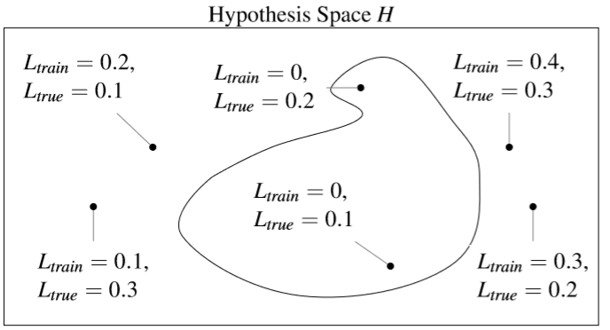
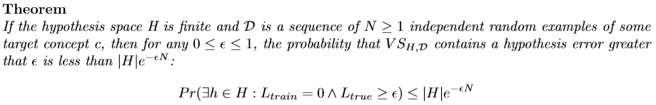
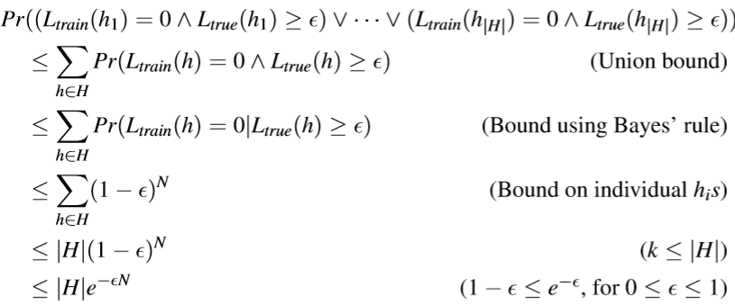
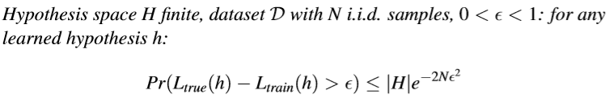
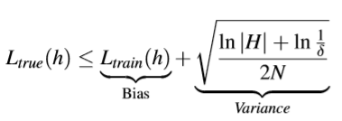

<div style="page-break-after: always;"></div> 

# PAC Learning and Agnostic Learning

***What do we mean as PAC-Learning and Agnostic-Learning?***

First, some concepts you need to know:

- We are talking about *Classification*.

- Overfitting happens:

  - Because with a large hypothesis space the training error is a bad estimate of the prediction error, hence we would like to infer something about the generalization error from the training samples. 
  - When the learner doesn’t have access to enough samples, hence we would like to estimate how many samples are enough.

This cannot be performed by measuring the bias and the variance, but we can bound them.

Given:

- Set of instances $\mathcal{X}$ 
- Set of hypothesis $\mathcal{H}$ (finite)
- Set of possible target concepts $C$. Each concept $c$ corresponds to a boolean function $c:\mathcal{X} \to\{0,1\}$ which can be viewed as belonging to a certain class or not
- Training instances generated by a fixed, unknown probability distribution $P$ over $X$. 

The learner observes a sequence $D$ of training examples $\langle x,c(x) \rangle$, for some target concept $c \in C$ and it must output a hypothesis $h$ estimating $c$.

$h$ is evaluated by its performance on subsequent instances drawn according to $P$
$$
L_{true} = Pr_{x \in P}[c(x) \neq h(x)]
$$
We want to bound $L_{true}$ given $L_{train}$, which is the percentage of misclassified training instances.

Let's talk now about *Version Spaces* : The version space $VS_{\mathcal{H},\mathcal{D}}$ is the subset of hypothesis in $H$ consistent with the training data $D$ (in other words is the subset of $H$ where $L_{train} = 0$).



How likely is the learner to pick a *bad hypothesis* ?



If you're interested in the proof:

------



where $k$ is (probably) the number of hypothesis $h \in VS_{\mathcal{H},\mathcal{D}}$  

------

Now, we use a *Probably Approximately Correct (PAC) bound*:

If we want this probability to be at most $\delta$ we can write
$$
|H|e^{-\epsilon N}\le \delta
$$
which means
$$
N \ge \frac{1}{\epsilon}\left(\ln|H|+\ln\left(\frac{1}{\delta}\right)\right)
$$
and
$$
\epsilon \ge \frac{1}{N}\left(\ln|H|+\ln\left(\frac{1}{\delta}\right)\right)
$$
Note that if, *for example*, we consider $M$ boolean features, there are $|C| = 2^M$ distinct concepts and hence $|H| = 2^{2^M}$ (which is huuuge)

If you wonder why let's suppose we have just $2$ boolean features ($A$ and $B$ ) , then we have $|H| = 2^{2^2} = 16$ distinct boolean functions :

```
A   B|  F0  F1  F2  F3  F4  F5  F6  F7
0   0|  0   0   0   0   0   0   0   0
0   1|  0   0   0   0   1   1   1   1
1   0|  0   0   1   1   0   0   1   1
1   1|  0   1   0   1   0   1   0   1

A   B|  F8  F9  F10 F11 F12 F13 F14 F15
0   0|  1   1   1   1   1   1   1   1
0   1|  0   0   0   0   1   1   1   1
1   0|  0   0   1   1   0   0   1   1
1   1|  0   1   0   1   0   1   0   1

function            symbol          name
F0                  0               FALSE
F1                  A ^ B           AND
F2                  A ^ !B          A AND NOT B
F3                  A               A
F4                  !A ^ B          NOT A AND B
F5                  B               B
F6                  A xor B         XOR
F7                  A v B           OR
F8                  A nor B         NOR
F9                  A XNOR B        XNOR
F10                 !B              NOT B
F11                 A v !B          A OR NOT B
F12                 !A              NOT A
F13                 !A v B          NOT A OR B
F14                 A nand B        NAND
F15                 1               TRUE
```

and so the bounds would have an *exponential* dependency on the number of features M !
$$
N \ge \frac{1}{\epsilon}\left(\ln|H|+\ln\left(\frac{1}{\delta}\right)\right)\\
N \ge \frac{1}{\epsilon}\left(\ln2^{2^M}+\ln\left(\frac{1}{\delta}\right)\right)\\
N \ge \frac{1}{\epsilon}\left(\underline{\underline{2^M}}\ln2+\ln\left(\frac{1}{\delta}\right)\right)\\
\epsilon \ge \frac{1}{N}\left(\ln|H|+\ln\left(\frac{1}{\delta}\right)\right)\\
\epsilon \ge \frac{1}{N}\left(\ln2^{2^M}+\ln\left(\frac{1}{\delta}\right)\right)\\
\epsilon \ge \frac{1}{N}\left(\underline{\underline{2^M}}\ln2+\ln\left(\frac{1}{\delta}\right)\right)
$$
which is bad news.

Instead of having an *exponential* dependency on $M$ we'd like to have a, *guess what?* , *polynomial* dependency!

Now, look at the bounds we defined earlier:
$$
N \ge \frac{1}{\epsilon}\left(\ln|H|+\ln\left(\frac{1}{\delta}\right)\right)\\
\epsilon \ge \frac{1}{N}\left(\ln|H|+\ln\left(\frac{1}{\delta}\right)\right)
$$
Consider a class $C$ of possible target concepts defined over a set of instances $X$ and a learner $L$ using hypothesis space $H$.

*Definition :*

$C$ is ***PAC-learnable*** it there exists an algorithm $L$ such that for every $c \in C$ , for any distribution $P$ , for any $\epsilon$ such that $0\le\epsilon\le\frac{1}{2}$ and $\delta$ such that $0\le\delta\le 1$, with probability at least $1-\delta$, outputs an hypothesis $h\in H$, such that $L_{true}(h) \le \epsilon$, using a number of samples that is polynomial of $\frac{1}{\epsilon}$ and $\frac{1}{\delta}$ 

$C$ is ***efficiently PAC-learnable*** by a learner $L$ using $H$ if and only if every $c \in C$ , for any distribution $P$ , for any $\epsilon$ such that $0\le\epsilon\le\frac{1}{2}$ and $\delta$ such that $0\le\delta\le \frac{1}{2}$, with probability at least $1-\delta$, outputs an hypothesis $h\in H$, such that $L_{true}(h) \le \epsilon$, using a number of samples that is polynomial of $\frac{1}{\epsilon}$ , $\frac{1}{\delta}$, $M$ and $size(c)$.

Let's talk now about ***Agnostic Learning***...

Usually the *train* error is not equal to zero, so the $VS$ is empty. In this case there is the need of bounding the gap between train and true errors.
$$
L_{true}(h) \le L_{train}(h) + \epsilon\\
L_{true}(h) - L_{train}(h)\le \epsilon
$$
Firstly, some background:

In probability theory , the *Hoeffding's inequality* provides an upper bound on the probability that the sum of bounded random variables deviates from its expected value by more than a certain amount. Formally speaking, for $N$ *i.i.d* coin flips $X_1,\dots,X_N$ where $X_i \in \{0,1\}$ and $0<\epsilon<1$ , we define the empirical mean
$$
\overline{X}=\frac{1}{N}(X_1+\dots+X_N)
$$
obtaining the following bound:
$$
Pr(\mathbb{E}[\overline{X}]-\overline{X}>\epsilon)<e^{-2N\epsilon^2}
$$
*Theorem:*



*PAC bound and Bias-Variance Tradeoff*



- For large $|H|$ 

  - Low bias (assuming we can find a good $h$ )
  - High variance (because bound is loser)

- For small $|H|$

  - High bias (is there a good $h$ ? )
  - Low variance (tighter bound)

- Given $\delta$, $\epsilon$ how large should $N$ be?
  $$
  N\ge\frac{1}{2\epsilon^2}\left(\ln |H|+\ln\frac{1}{\delta}\right)
  $$

