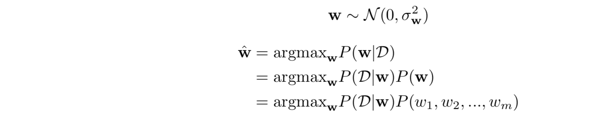
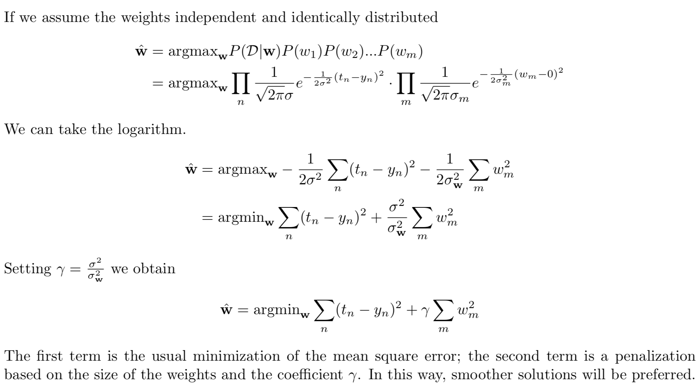

# Ridge Regression vs Bayesian Linear Regression

***Describe the ridge regression algorithm and compare it with the Bayesian linear regression approach.***

`INCOMPLETE: THIS JUST EXPLAIN THE BAYESIAN APPROACH (ALREADY SEEN IN SOFT COMPUTING -> MAXIMUM A POSTERIORI ESTIMATION)`

I've already described Ridge Regression previously.

*Comparison:*

Ridge Regression is a frequentist approach:  
the model assumes that the response variable (y) is a linear combination of weights multiplied by a set of predictor variables (x). The full formula also includes an error term to account for random sampling noise. 

What we obtain from frequentist linear regression is a single estimate for the model parameters based only on the training data. Our model is completely informed by the data: in this view, everything that we need to know for our model is encoded in the training data we have available.

Ridge Regression gives us a single point estimate for the output. However, if we have a small dataset we might like to express our estimate as a distribution of possible values. This is where Bayesian Linear Regression comes in.

The aim of Bayesian Linear Regression is not to find the single “best” value of the model parameters, but rather to determine the *posterior distribution* (*a probability distribution that represents your updated beliefs about the parameter after having seen the data*) for the model parameters.  
Not only is the response generated from a probability distribution, but the model parameters are assumed to come from a distribution as well. The posterior probability of the model parameters is conditional upon the training inputs and outputs:
$$
P(\beta|y,X)=\frac{P(y|\beta,X)P(\beta|X)}{P(y|X)}
$$
Here, ${P(\beta |y,X)}$ is the posterior probability distribution of the model parameters given the inputs and outputs. This is equal to the likelihood of the data, ${P(y|\beta,X)}$, multiplied by the prior probability of the parameters and divided by a normalization constant. This is a simple expression of Bayes Theorem, the fundamental underpinning of Bayesian Inference:
$$
Posterior = \frac{Likelihood*Prior}{Normalization}
$$
Let's stop and think about what this means. In contrast to Ridge Regression , or Linear Regression in general, we have a *posterior* distribution for the model parameters that is proportional to  

- The likelihood of the data
- The prior probability of the parameters

Here we can observe the two primary benefits of Bayesian Linear Regression:

1. **Priors**:   
   if we have domain knowledge, or a guess for what the model parameters should be, we can include them in our model, unlike in the frequentist approach which assumes everything there is to know about the parameters comes from the data. If we don't have any estimates ahead of time, we can use <u>non-informative priors</u> for the parameters such as a normal distribution.
2. **Posterior**:  
   The result of performing Bayesian Linear Regression is a distribution of possible model parameters based on the data and the prior.  
   This allows us to quantify our uncertainty about the model: if we have fewer data points, the posterior distribution will be more spread out.

The formulation of model parameters as distributions encapsulates the Bayesian worldview: we start out with an initial estimate, our prior, and as we gather more evidence, **our model becomes less wrong**. Bayesian reasoning is a natural extension of our intuition. Often, we have an initial hypothesis, and as we collect data that either supports or disproves our ideas, we change our model of the world (ideally this is how we would reason)!

***We can derive Ridge Regression from Bayesian Linear Regression!***
If we choose a prior distribution as follows:

