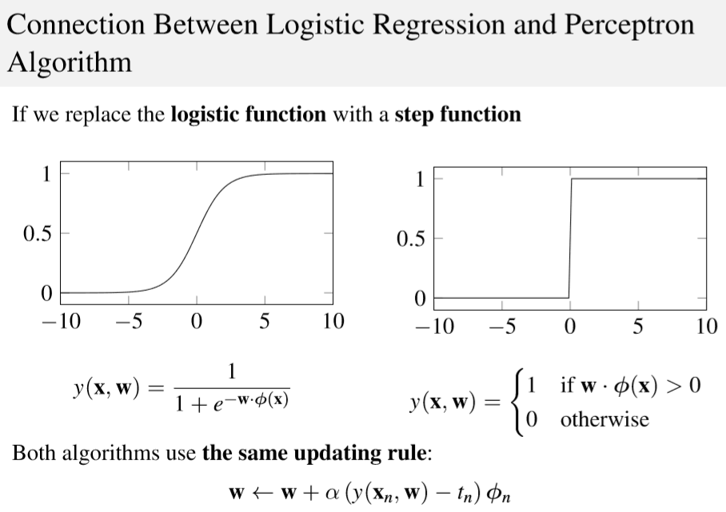

# Logistic Regression 

***Describe the logistic regression algorithm and compare it with the perceptron algorithm.***

Although the name might confuse, please note that it is a *classification* algorithm.

Considering a problem of two-class classification, in logistic regression the posterior probability of class $C_1$ can be written as a logistic sigmoid function:
$$
p(C_1|\phi) = \frac{1}{1+e^{-\mathbf{w}^T\phi}}=\sigma(\mathbf{w}^T\phi)
$$

and $p(C_2|\phi) = 1 - p(C_1|\phi)$ 

(we write $\phi$ instead of $\phi(\mathbf{x})$ just for simplicity)

Applying the *Maximum Likelihood* approach...

Given a dataset $\mathcal{D} = \{\mathbf{x}_n,t_n\}$, $t_n \in \{0,1\}$, we have to maximize the probability of getting the right label:
$$
P(\mathbf{t}|\mathbf{X},\mathbf{w}) = \prod_{n=1}^{N}y_n^{t_n}(1-y_n)^{1-t_n},\ \ y_n = \sigma(\mathbf{w}^T\phi_n)
$$
Taking the negative log of the likelihood, the *cross-entropy* error function can be defined and it has to be minimized:
$$
L(\mathbf{w}) = -\ln P(\mathbf{t}|\mathbf{X},\mathbf{w}) = -\sum_{n=1}^{N}(t_n\ln y_n+(1-t_n)\ln(1-y_n))=\sum_{n}^NL_n
$$
Differentiating and using the chain rule:
$$
\frac{\part L_n}{\part y_n}= \frac{y_n-t_n}{y_n(1-y_n)},\ \ \ \ \frac{\part y_n}{\part\mathbf{w}}=y_n(1-y_n)\phi_n\\
\frac{\part L_n}{\part \mathbf{w}}= \frac{\part L_n}{\part y_n}\frac{\part y_n}{\part\mathbf{w}}=(y_n-t_n)\phi
$$
The gradient of the loss function is
$$
\nabla L(\mathbf{w}) = \sum_{n=1}^{N}(y_n-t_n)\phi_n
$$
It has the same form as the gradient of the sum-of-squares error function for linear regression. But in this case $y$ is not a linear function of $\mathbf{w}$ and so, there is no closed form solution. The error function is *convex* (only one optimum) and can be optimized by standard *gradient-based* optimization techniques. It is, hence, easy to adapt to the online learning setting.

Talking about *Multiclass Logistic Regression*...

For the multiclass case, the posterior probabilities can be represented by a *softmax* transformation of linear functions of feature variables:
$$
p(C_k|\phi)=y_k(\phi)=\frac{e^{\mathbf{w}_k^T\phi}}{\sum_j e^{\mathbf{w}_j^T\phi}}
$$
$\phi(\mathbf{x})$ has been abbreviated with $\phi$ for simplicity.

*Maximum Likelihood* is used to directly determine the parameters
$$
p(\mathbf{T}|\Phi,\mathbf{w}_1,\dots,\mathbf{w}_K)=\prod_{n=1}^{N}{\underset{\text{Term for correct class$\;\;\;\;\;\;\;\;\;\;\;\;\;\;\,\,\;\;\;\;\;\;\;\;\;\;\;$}}{\underbrace{\left(\prod_{k=1}^{K}p(C_k|\phi_n)^{t_{nk}}\right)}=\prod_{n=1}^{N}\left(\prod_{k=1}^{K}y_{nk}^{t_{nk}}\right)}}\\
$$
where $y_{nk}=p(C_k|\phi_n)=\frac{e^{\mathbf{w}_k^T\phi_n}}{\sum_j e^{\mathbf{w}_j^T\phi_n}}$

The *cross-entropy* function is:
$$
L(\mathbf{w}_1,\dots,\mathbf{w}_K)=-\ln p(\mathbf{T}|\Phi,\mathbf{w}_1,\dots,\mathbf{w}_K)=-\sum_{n=1}^{N}\left(\sum_{k=1}^{K}t_{nk}\ln y_{nk}\right)
$$
Taking the gradient
$$
\nabla L_{\mathbf{w}_j}(\mathbf{w}_1,\dots,\mathbf{w}_K) =\sum_{n=1}^{N}(y_{nj}-t_{nj})\phi_n
$$
The *perceptron* is an example of *linear discriminant models*, it is an *online* linear classification algorithm.
$$
y(\mathbf{x})=f(\mathbf{w}^T\phi(\mathbf{x}))\\
\text{where}\\

f(a)=
\begin{cases}
+1,\ \ a\ge0\\
-1,\ \ a < 0
\end{cases}
$$
Target values are $+1$ for $C_1$ and $-1$ for $C_2$.

The algorithms finds the *separating hyperplane* by minimizing the distance of *misclassified points* to the *decision boundary*.

Using the number of misclassified points as loss function is not effective since it is a *piecewise constant function*.

We are seeking a vector $\mathbf{w}$ such that $\mathbf{w}^T\phi(\mathbf{x}_n)>0$ when $\mathbf{x}_n \in C_1$ and $\mathbf{w}^T\phi(\mathbf{x}_n)<0$ otherwise.

The *perceptron criterion* assigns

- zero error to correct classification
- $\mathbf{w}^T\phi(\mathbf{x}_n)t_n$ to misclassified patterns $\mathbf{x}_n$ (it is proportional to the distance to the decision boundary)

The *loss* function to be minimized is
$$
L_P(\mathbf{w}) =-\sum_{n\in \mathcal{M}}\mathbf{w}^T\phi(\mathbf{x}_n)t_n
$$
Minimization is performed using *stochastic gradient descent* :
$$
\mathbf{w}^{k+1}=\mathbf{w}^k-\alpha\nabla L_P(\mathbf{w})=\mathbf{w}^k+\alpha\phi(\mathbf{x}_n)t_n
$$
Since the perceptron function does not change if $\mathbf{w}$ is multiplied by a constant, the *learning rate $\alpha$ can be set to $1$*

The effect of a single update is to *reduce the error* due to the *misclassified pattern*, this *does not imply* that the *loss* is reduced at each stage.

*Theorem* (***Perceptron Convergence Theorem***)

"If the training data set is *linearly separable* in the feature space $\phi$, then the perceptron learning algorithm is guaranteed to find an exact solution in a finite number of steps."

*Problems*:

- The number of steps before convergence may be substantial.
- We are not able to distinguish between *non-separable* problems and *slowly converging* ones.
- If multiple solutions exist, the one found depends by the *initialization* of the parameters and the *order of presentation* of the data points.

*Please Note* : Here we use the *step function* instead of the *sign function* for the Perceptron!