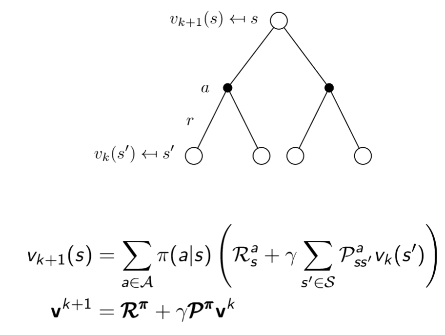

# Policy Iteration

***Describe the policy iteration technique for control problems on Markov Decision Processes***  
 If you want a concise answer just go to the end.  
premise: what is a control problem? is the task of finding the optimal value function, which translates into finding the optimal policy.  
Policy Iteration is a dynamic programming policy optimization technique that can be decoupled in two phases:

- Policy Evaluation
- Policy Improvement

***Policy Evaluation*** 
Consists in computing the state-value function ${V^\pi}$ for a given policy ${\pi}$.   
It is done by iteratively applying the Bellman expectation backup.  
$$
V_{k+1}(s)\leftarrow \sum_{a\in A}\pi (a|s)\Bigg[R(s,a)+\gamma \sum_{s'\in S}P(s'|s,a)V_k(s') \Bigg]
$$
Applying a backup operation to each state is called **sweep**.  

What we will actually do is to start off with an arbitrary initial value function, let's call it ${V_1}$. So, this ${V_1}$ tells us what is the value of all states in the MDP (the canonical case is to start with ${V(\forall s)=0}$).  
Afterwards we are going to plug in one step of our Bellman equation: we do a one step lookahead and doing so we figure out a new value function that we call ${V_2}$.  
If we iterate this process many times we end up with the true value function ${V_\pi}$.  
$$
V_1\to V_2 \to... \to V_\pi
$$
Ok, but how do we actually pass from ${V_k}$ to ${V_{k+1}}$?  

We do it by using *synchronous backups*: 

- at each iteration ${k+1}$
- for all states ${s \in S}$
- update ${V_{k+1}(s)}$ from ${V_k(s')}$ ,  where ${s'}$ is a successor state of ${s}$

So let's understand exactly how to do such update:  

The picture in the previous page shows our one-step lookahead tree and the *Bellman Expectation Equation*, what do they tell us?  
They tell us that the value of the root is given by a one-step lookahead: we consider all the actions we might take and all the states we might go in.  
We know the value of each state we might go in, so we back them all up (summing them together weighted by the probabilities involved) and we get the new value of the root.  
Why do we know the value of such successor states? Because in our example they are all leaves, obviously if they weren't leaves we should have iterated the process over such states.

So, imagine just to start always from the root of your tree, go down the tree until you find the leaves, and then come back up by doing what I just described.  
Ok but by doing so we just "changed our skin" once, we went from ${V_1}$ to ${V_2}$ for example. Well, in order to go from ${V_2}$ to ${V_3}$ and in the end find ${V_\pi}$ we just iterate this process of updating ${V}$.

So, let's consider we just computed ${V_2}$, now we simply plug ${V_2}$ into the leaves, back them up, and get ${V_3}$ at the root.

This process is guaranteed to converge to the true value function ${V_\pi}$ (pay attention, it's not that it converges to the optimal value function, it might, but what I'm saying is that it converges to the value function of the policy you are considering!).

Let's make and example:   

This is called the Small Gridworld example.  
There are two terminal states (the top left and bottom right squares). there are 14 non-terminal states. The reward is -1 until the terminal state is reached. 
For now consider only the left column of the following images:   

Our initial estimate for each state is a trivial 0.  
Now we apply one step of iterative policy evaluation and we'll end up with a new value for each of these states.

For example, let's look at the update from ${k=0}$ to ${k=1}$.  We updated the value of almost each state to -1.0 because whichever step I take is going to give me -1 unless I'm already at the goal (in fact the two terminal states keep on having 0).  
Now let's consider the grid in ${k=2}$ and in particular third cell in the second row.  
In the grid with ${k=1}$ it contained a ${-1.0}$, while now it contains ${-2.0}$. This is due to the fact that wherever I go from that cell (left,up,right,down), I have an immediate cost of ${-1}$ and I find myself in a state with value ${-1}$, in fact all the states around such cell contain a ${-1}$. So the value gets updated to the average of all of these returns, and it's ${-2}$.

Always considering the transition from ${k=1}$ to ${k=2}$, look at the second cell of the first row. It gets updated to ${1.75}$ (in the image you'll see ${1.7}$ just because it was truncated). Why ${1.75}$? because if I go up, I actually stick where I am, so I pay ${-1}$ for the action and ${-1}$ because I end up in a state whose value is ${-1}$. Same thing for moving on the right and on the bottom. If instead I move to the left, I get rewarded ${-1}$ for the action but I end up in a state whose value is ${0}$, so let's average: ${\frac{(-1-1)+(-1-1)+(-1-1)+(-1)}{4}=-1.75}$.

Ok, enough examples.

If we keep on iterating, we end up with the true value function ${(k=\infty)}$ and this value function tells us how many steps on average I'd need to take from each state in order to reach a terminal state following a uniform policy (0.25 possibility of going in each direction).  
Ok, policy evaluation is done.

 

***Policy Improvement***

Now let's talk about the column on the right:  
While evaluating we can improve our policy by acting greedily wrt to the value function!  
Already in the second grid ${(k=1)}$ we can see that if we find ourselves in the second cell of the first row, the only reasonable thing to do is to go left, because the value of all the other neighbors is worse.

So one interesting thing about Policy Evaluation is that, by evaluating our policy, we could infer a new policy!  

And there is more: after a few iterations of policy evaluation (in our example, when ${k=3}$) , even if the true value function has not been determined yet, the new policy has usually already converged, because it depends on the shape of ${V}$, not on its absolute value. So, instead of using the closed form solution, which is expensive, applying the iteration for a few steps allows to have a bad approximation of the value function, but a good estimation of the policy (this concept is the key for the *modified policy iteration* algorithm, we'll see it soon).   

Very important: In the Small Gridworld example we are lucky because the first value function we evaluate (approximate evaluation for ${k=3}$ or full evaluation for ${k=\infty}$) gives us right away the optimal policy, but this is not always the case!  

*Policy improvement* consists in changing the policy according to the newly estimated values.  
For a given state ${s}$, would it be better to do an action  ${a \neq \pi(s)}$?  
We can improve the policy by acting greedily:  
$$
\pi'(s)=arg\  \max_{a \in A}Q^\pi(s,a)
$$
This improves the value from any state ${s}$ over one step  
$$
Q^\pi(s,\pi'(s))=\max_{a \in A}Q^\pi(s,a)\ge Q^\pi(s,\pi(s))=V^\pi(s)
$$
<u>*Theorem: Policy Improvement theorem*</u>

let ${\pi}$ and ${\pi '}$ be any pair of deterministic policies such that
$$
Q^\pi(s,\pi '(s))\ge V^\pi(s) \ \ \ , \ \ \ \forall s \in S
$$
Then, the policy ${\pi '}$ must be as good as, or better than ${\pi}$
$$
V^{\pi'}(s)\ge V^\pi (s) \ \ \ , \ \ \ \forall s \in S
$$

 

***Let's put it all together and optimize***

<u>*policy iteration*</u>

1. You start from any policy you want
2. fully evaluate that policy by iterating policy evaluation until ${k\to\infty}$ 
3. come up with a better policy by acting greedily wrt the old policy.
4. if you haven't found the optimal policy yet consider the new policy and go back to step 2, otherwise terminate.

Optimizations:  

*<u>modified policy iteration</u>* (the step 2 is explained at the beginning of the *Policy Improvement* section):

1. You start from any policy you want
2. approximately evaluate that policy by iterating policy evaluation until ${k\to const}$ 
3. come up with a better policy by acting greedily wrt the old policy.
4. if you haven't found the optimal policy yet consider the new policy and go back to step 2, otherwise terminate.

<u>*value iteration*</u>

1. You start from any policy you want
2. very approximately evaluate that policy by doing policy evaluation just once ${(k=1) }$ 
3. come up with a better policy by acting greedily wrt the old policy.
4. if you haven't found the optimal policy yet consider the new policy and go back to step 2, otherwise terminate.

**Concise Answer**

Policy Iteration is a dynamic programming policy optimization technique that can be decoupled in two phases:

- Policy Evaluation
- Policy Improvement

<u>*Policy Evaluation*</u>

An iterative policy evaluation is performed by applying the Bellman expectation backup an infinite number of times. A full policy-evaluation backup
$$
V_{k+1}(s)\leftarrow \sum_{a\in A}\pi (a|s)\Bigg[R(s,a)+\gamma \sum_{s'\in S}P(s'|s,a)V_k(s') \Bigg]
$$
Applying a backup operation to each state is called *sweep*.  
We use synchronous backups: 

- at each iteration ${k+1}$
- for all states ${s \in S}$
- update ${V_{k+1}(s)}$ from ${V_k(s')}$ ,  where ${s'}$ is a successor state of ${s}$

After few iterations even if the true value function is not determined, the policy has usually already converged, because it depends on the shape of V, not on its absolute value. So, instead of using the closed form solution, which is expensive, applying the iteration for a few steps allows to have a bad approximation of the value function, but a good estimation of the policy. The usage of this approximated evaluation combined with policy improvement is called *modified policy evaluation*.

*<u>Policy improvement</u>*  
It consists in changing the policy according to the newly estimated values.  
For a given state ${s}$, would it be better to do an action  ${a \neq \pi(s)}$?  
We can improve the policy by acting greedily:  
$$
\pi'(s)=arg\  \max_{a \in A}Q^\pi(s,a)
$$
This improves the value from any state ${s}$ over one step  
$$
Q^\pi(s,\pi'(s))=\max_{a \in A}Q^\pi(s,a)\ge Q^\pi(s,\pi(s))=V^\pi(s)
$$
<u>*Theorem: Policy Improvement theorem*</u>

let ${\pi}$ and ${\pi '}$ be any pair of deterministic policies such that
$$
Q^\pi(s,\pi '(s))\ge V^\pi(s) \ \ \ , \ \ \ \forall s \in S
$$
Then, the policy ${\pi '}$ must be as good as, or better than ${\pi}$
$$
V^{\pi'}(s)\ge V^\pi (s) \ \ \ , \ \ \ \forall s \in S
$$
  ( Sources: PMDS Notes ${\leftarrow}$ there are some mistakes though - [Deep Mind Dynamic Programming](https://www.youtube.com/watch?v=Nd1-UUMVfz4&t=142s) )