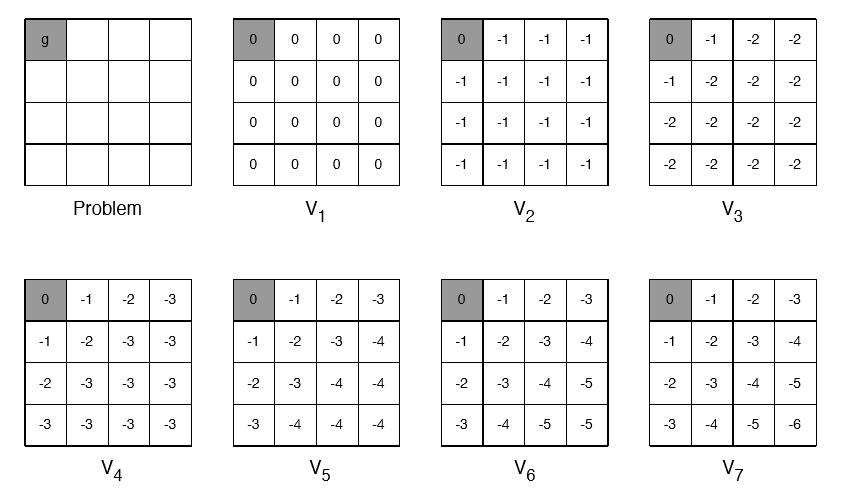
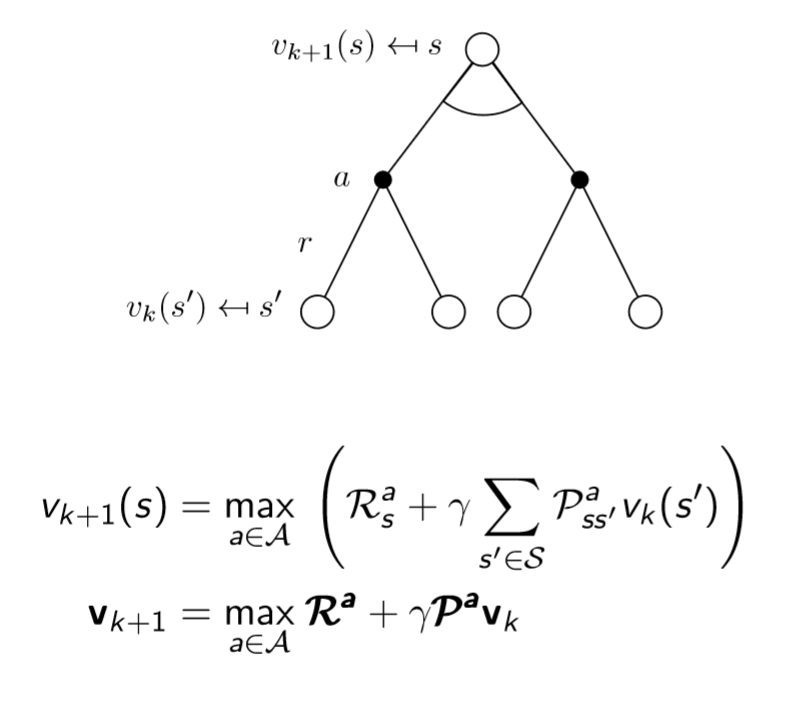

# Value Iteration

***Describe the value iteration algorithm. Does the algorithm always return the optimal policy?***   

If you are looking for a concise answer go to the end.

Value iteration is the most popular dynamic programming algorithm applied in model based scenarios. 

Value iteration is based on the principle of Optimality:

If the first action I take is optimal and then I follow an optimal policy from whichever state I end up, the overall behavior is optimal.

***Principle of Optimality***  
A policy ${\pi(a|s)}$ achieves the optimal value from state ${s}$ , ${v_\pi (s)=v_* (s)}$, if and only if, for any state ${s'}$ reachable from ${s}$,   
${\pi}$ achieves the optimal value from state ${s'}$, ${v_\pi (s')=v_*(s')}$.

Ok, how to exploit this?  
If we know the solution to the subproblems ${v_* (s')}$, we can find ${v_* (s)}$ just by applying a one-step lookahead:
$$
v_* (s) \leftarrow \max _{a \in A}\bigg\{{R_s^a+\gamma \sum_{s' \in S}P_{ss'}^a v_*(s')\bigg\} }
$$
The idea of value iteration is to apply these update iteratively:  
we plug into the right member of the equation the current value function (so, it's not optimal at first!), obtain a new value function, plug such new value function to the right member, obtain a new value function, and so on until we find the optimal value function.

Intuition: start with the final rewards and work backwards.  
Shortest Path Example:    
 

This problem consists in finding the optimal value function for each cell. the goal of the game is to reach the terminal state (top-left corner), the possible actions are move left, up,right, down.  
Each actions' reward is ${-1}$. 

 

With value iteration we are able to find the optimal value function just by iterating on the Bellman's Optimality Equation.

We initialize all the values to ${0}$.

from ${ V_2}$ to $V_3$  we have that 

${[0,0]}$:
$$
V_* ([0,0]) \leftarrow \max _{a \in A}\bigg\{R_s^a+\gamma \sum_{s' \in S}P_{ss'}^a V_*(s') \bigg\}
$$

$$
V_* ([0,0]) \leftarrow 0+1 \sum_{s' \in S}P_{ss'}^a V_*(s')
$$

$$
V_* ([0,0]) \leftarrow 0+0
$$

${[0,1]}$:
$$
V_* ([0,1]) \leftarrow \max _{a \in A}\bigg\{R_s^a+\gamma \sum_{s' \in S}P_{ss'}^a V_*(s') \bigg\} 
  \\
  V_* ([0,1]) \leftarrow -1+1 \bigg(1\cdot0\bigg) 
  \\
  V_*([0,1])\leftarrow-1
$$
  ${[2,2]}$:
$$
V_*([2,2])\leftarrow -1+1\cdot\bigg(1\cdot(-1)\bigg)
  \\
  V_*([2,2])\leftarrow-2
$$
(In ${[2,2]}$ I chose randomly to perform one of the actions, they all give the same result. In ${[0,1]}$ I considered moving west since it's the most convenient choice).

I did a couple of examples for ${V_2}$, hopefully you can get the sense of the algorithm.

Let's take stock of the situation: value iteration is a method for solving MDPs, how do we do it? by applying iteratively the Bellman Optimality Equation, doing so we find the optimal value function.
$$
  v_1 \to v_2 \to v_3 \to... \to v_*
$$
  *What are the differences between policy iteration and value iteration?*

- in Value Iteration we are not building a policy at each step, we are working directly in value space. In Policy Iteration there is an alternation between value and policy space.
- Intermediate value functions of Value Iteration may not correspond to any policy, while intermediate value functions of Policy Iteration surely do. What does this mean? It means that in Value Iteration, during the iteration, we could get an intermediate ${v}$,  which does not correspond to any ${v_\pi}$ for any ${\pi}$.
- We can say that Value Iteration is equivalent to do Modified Policy Iteration with ${k=1}$. 

 

*One last image to sum up:*  

*In a nutshell:* 

1. Take the current value function and plug it in the leaves. 
2. for each state (consider it the root of the tree):  
   Such root
   1. Does a lookahead
   2. Maximizes over all the things it might do
   3. Takes an expectation over all the things the environment might do. 
   4. Backs it up to get its new value.
3. Back to step 1 until you find the optimal policy

  Important: Value Iteration assures to find the optimal value function, consequently it assures to find the optimal policy. 

  How come?

  Define the max-norm: ${||V||_\infty}=\max_s|V(s)|$

  *Theorem*:

  Value Iteration converges to the optimal state-value function ${\lim_{k\to\infty}V_k=V^*}$

  *Proof*:
$$
  ||V_{k+1}-V^*||_\infty =||T^*V_k-T^*V^*||_\infty\le \gamma||V_k-V^*||_\infty \\
  \le  \ ... \ \le \gamma^{k+1}||V_0-V^*||_\infty \to \infty
$$
  *Theorem*  
$$
||V_{i+1}-V_i||_\infty < \epsilon \implies ||V_{i+1}-V^*||_\infty < \frac{2\epsilon\gamma}{1-\gamma}
$$

 

***Concise Answer***  

Value iteration is the most popular dynamic programming algorithm applied in model based scenarios.

The problem of finding the optimal policy ${\pi_*}$ is solved by iteratively applying the Bellman Optimality equation, without any explicit policy.  
In fact, intermediate value functions may not correspond to any policy.  

  *Bellman's Optimality Equation*:
$$
  v_* (s) \leftarrow \max _{a \in A}\bigg\{{R_s^a+\gamma \sum_{s' \in S}P_{ss'}^a v_*(s')\bigg\} }
$$
  Value Iteration always return the optimal policy, as shown by the following theorem.

  Define the max-norm: ${||V||_\infty}=\max_s|V(s)|$

  *Theorem*:

  Value Iteration converges to the optimal state-value function ${\lim_{k\to\infty}V_k=V^*}$

  *Proof*:
$$
||V_{k+1}-V^*||_\infty =||T^*V_k-T^*V^*||_\infty\le\gamma||V_k-V^*||_\infty 
  \le  \ ... \ \le \gamma^{k+1}||V_0-V^*||_\infty \to \infty
$$
  *Theorem*  
$$
  ||V_{i+1}-V_i||_\infty < \epsilon \implies ||V_{i+1}-V^*||_\infty < \frac{2\epsilon\gamma}{1-\gamma}
$$
  ( Sources: PMDS Notes - [Deep Mind Dynamic Programming](https://www.youtube.com/watch?v=Nd1-UUMVfz4&t=142s) )