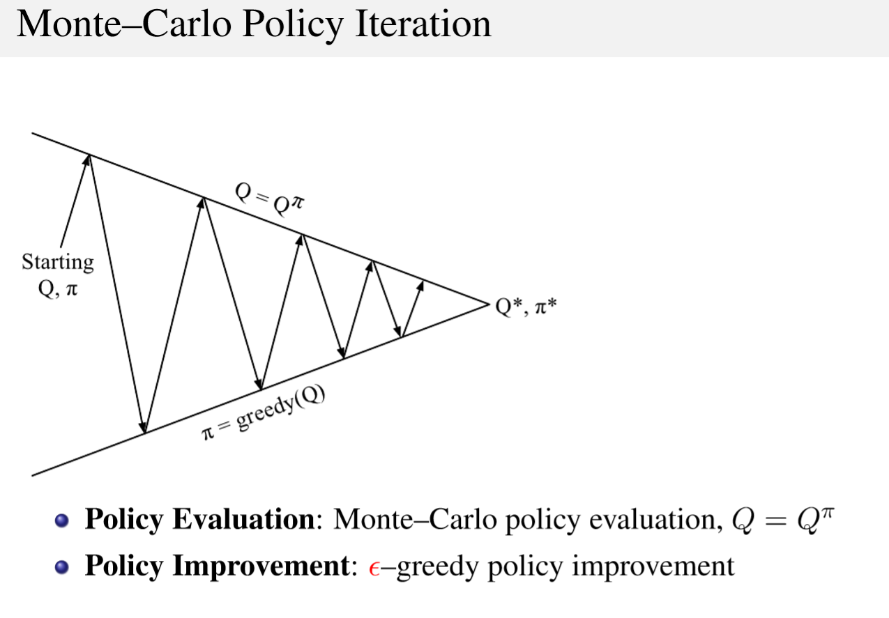
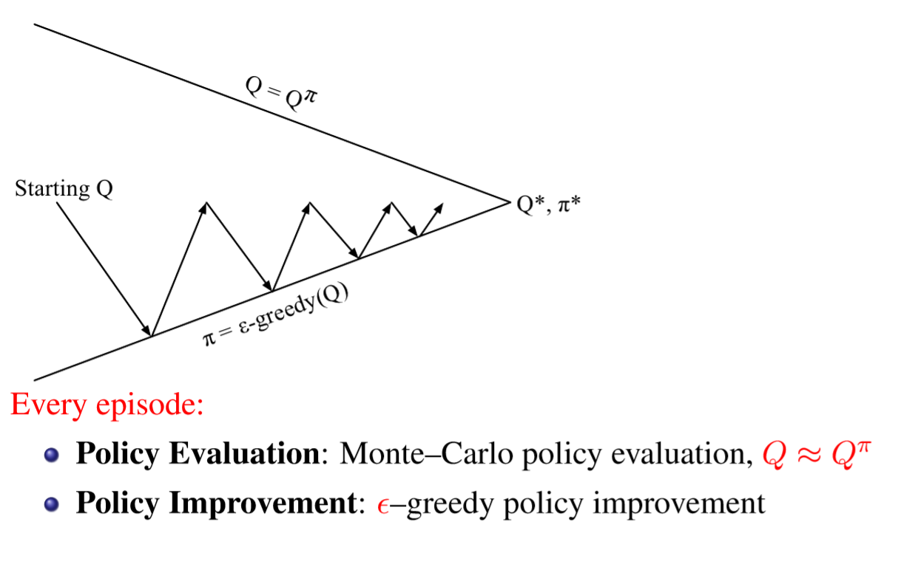

# Prediction vs Control

***Describe the two problems tackled by Reinforcement Learning (RL): prediction and control. Describe how the Monte Carlo RL technique can be used to solve these two problems.***   

- Prediction:  
  this type of task consists in predicting the expected total reward from any given state assuming the function ${\pi(a|s)}$ is given. 
- Control:  
  This type of task consists in finding the policy ${\pi(a|s)}$ that maximizes the expected total reward from any given state. In other words, some policy ${\pi}$ is given, and it finds the optimal policy ${\pi^*}$. 

Monte Carlo is Model Free RL technique.  
Model Free means that we don't have complete knowledge of the environment, namely, we don't know the transition matrix ${P}$ and the rewards ${r}$ associated with each state-action pair.  

***Prediction In Monte Carlo***  
The way Monte Carlo estimates the state-value function for a given policy from experience is simply by averaging the returns observed after visits to that state. As more returns are observed, the average should converge to the expected value. 

So Monte Carlo policy evaluations uses empirical mean return instead of the expected return and it can be computed with two different approaches:

- First-Visit MC  
  Average returns only for the first time ${s}$ is visited (**unbiased** estimator) in an episode
- Every-Visit MC  
  Average returns for every time ${s}$ is visited (**biased** but **consistent** estimator)

Once an episode is over, we proceed with updating the two values

- ${V(s)}$ : the state-value function
- ${N(s)}$: the total number of times ${s}$ has been visited

for each state ${s}$ that has been visited during the last episode.

${N(s_t)\leftarrow N(s_t)+1}$

${V(s_t)\leftarrow V(s_t)+ \frac{1}{N(s_t)}(\color{red}v_t-V(s_t)\color{black} )}$

So what have we done? 

1. We incremented the number of occurrences ${N}$ of the visited state ${s_t}$.
2. We updated our estimate of ${V}$ a little bit in the direction of the error (red colored) between the old expected value of ${V}$ and the return we actually observed during this episode ${v_t}$.  
   Just think of it as saying that ${V}$ is exactly the same ${V}$ as before but incremented/decremented of a small quantity weighted by ${\frac{1}{N(s_t)}}$.  Or google *incremental mean* to get such equation starting from the generic equation of the *arithmetic mean*. 

 

***Control in Monte Carlo***

{DISCLAIMER: I derived MC Control step by step, if you want you can jump to *GLIE Monte Carlo Control* for the short answer}  
We use Policy Iteration for the control tasks.

It is composed of Policy Evaluation and Policy Improvement.

- Policy Evaluation:  
  Estimate ${v_\pi}$ 
- Policy Improvement  
  Generate ${\pi ' \ge \pi}$ 

 So let's try to plug in this iteration process in Monte Carlo.  
The first thing that comes up in our mind is to do the following:  

Which means, estimate the ${V}$ values of the visited states ${s}$ using policy ${\pi}$ and then act greedily wrt to ${V}$ to improve our policy.   
(The diagram above shows the iteration process: while the arrow goes up we do evaluation, while it goes down we do improvement. These arrows become smaller and smaller because after some iterations ${V}$ and ${\pi}$ converge.)

There are actually two problems with this  approach: we can't use ${V}$ and we can't be so greedy.

***We can't use ${V}$***:

we want to be model free, but how can we me model free if we are using the state-value function ${V}$?   
We'd still need a model of the MDP to figure out how to act greedily wrt to ${V}$. We'd only know the values of the estimated return of each state, and we want to know what action is the best to be taken, so we would have to imagine in which state ${s'}$ we would go for each possible action. But wait, we don't know the transition matrix ${P}$!  
The solution consists in using ${Q}$. action-value functions ${(Q)}$ allow us to do control in a model free setting.  
$$
Q(s_t,a_t)\leftarrow Qs(s_t,a_t)+\frac{1}{N(s_t,a_t)}\bigg(v_t-Q(s_t,a_t)\bigg)
$$
sum up:  
Greedy Policy Improvement over ${V(s)}$ *requires model* of MDP (can't be used in model free setting)
$$
\pi'(s)=arg \max_{a \in A}\bigg(R(s,a)+P(s'|s,a)V(s')\bigg)
$$

 

Greedy Policy Improvement over ${Q(s,a)}$ is *model-free*
$$
\pi'(s)=arg \max_{a \in A}Q(s,a) 
$$
So here we are, this is our new approach:

  

The same as before, but instead of ${V}$ we use ${Q}$

  

***We can't be so greedy***

If we act greedily all the time we don't do exploration, we just do exploitation: we just exploit what looks to be the best path, but maybe there is another path that for the first steps does not give us a good reward, but later on gives us a better reward than the path we are exploiting.  
The simplest idea for ensuring continual exploitation is to use an ${\epsilon}$-greedy approach:
$$
  \pi(s,a)=
  \begin{cases}
  \frac{\epsilon}{m}+1-\epsilon \ \ \ \ \ if \ a^*=arg \max_{a \in A}Q(s,a) \\
  \frac{\epsilon}{m} \ \ \ \ \ \ \ \ \ \ \ \ \ \ \ \ \ \  otherwise
  \end{cases}
$$
This means that all ${m}$ actions are tried with a non-zero probability. With probability ${\frac{\epsilon}{m}+1-\epsilon}$ we choose the greedy action, and with probability ${\frac{\epsilon}{m}}$ we choose any of the remaining ${m-1}$ actions. Pay attention: we could see it as choosing the greedy action with probability ${1-\epsilon}$ and with probability ${\frac{\epsilon}{m}}$ any of the actions, including the greedy one.  
This approach works well, and this is shown by the Policy Improvement Theorem:  
For any ${\epsilon}$–greedy policy ${\pi}$, the ${\epsilon}$–greedy policy ${\pi '}$ wrt ${Q^\pi}$ is an improvement.  
Therefore ${V^{\pi'}(s)\ge V^{\pi}(s)}$ 
(The demonstration of the theorem is easily findable on the internet or on page 56 of Restelli's slides of lecture 10 ).  
Moreover, when the number of episodes ${k\to \infty}$, the policy converges on a greedy policy

Here we are with our new approach:

  

We just got rid of the greedy improvement, and went for an ${\epsilon}$-greedy one. (yes, there is a mistake in the slide, in the diagram there should be written ${\pi=\epsilon}$-greedy${(Q)}$) )

***But there is more!***

Let's make this a little more efficient:  
In this kind of policy iteration frameworks, it's not necessary to fully evaluate our policy (run many episodes and get the mean return for each ${Q}$): we can just run **one** episode, update only the ${Q}$ values of the state-action pairs we visited during such episode (evaluation), improve our policy based on the new ${Q}$s we obtained, and repeat. Why should we wait to get more episodes of information when we could already improve the policy?   
So once again, here we are with our new approach:

  

**No, we are not done yet, there's still one little problem to solve**    
We almost have the full picture. One last step:    
How can we really guarantee that we find the best possible policy? what we really want to find is ${\pi^*}$, the optimal policy. Such policy is greedy by definition, it tells us what action to take (with no doubts) in state ${s}$.  
So what we want to do is to explore in order to make sure we are not missing out on anything, but at a certain point, asymptotically, we want to stop exploring, and just exploiting.  
This translates into the GLIE property (Greedy in the Limit with Infinite Exploration):

- All state-action pairs are explored **infinitely** many times:  
  $$
  \lim_{k\to\infty}N_k(s,a)=\infty
  $$

- The policy **converges** on a **greedy** policy:  
  $$
  \lim_{k\to\infty}\pi_k(a|s)=
  \begin{cases} 
  \mathbf{1} \ \ \ \ if \ a=\arg \max_{a'\in A}Q_k(s,a') \\
  \mathbf{0} \ \ \ \ otherwise
  \end{cases}
  $$
  (on Restelli's slides there is a mistake: there's written ${Q_k(s',a')}$ but that ${s'}$ should be ${s}$. )

  Now we are ready to actually answer the question: what is used in Monte Carlo Control?
  Here it is:  
  **GLIE Monte Carlo Control**  

1. Sample ${k}$-th episode using ${\pi}$: ${\{S_1,A_1,R_2,...,S_T\} \sim \pi}$  

2. For each state ${S_t}$ and action ${A_t}$ visited in the episode:  
   $$
   N(S_t,A_t) \leftarrow N(S_t,A_t)+1
   $$

   $$
   Q(S_t,A_t)\leftarrow Q(S_t,A_t)+\frac{1}{N(S_t,A_t)}(G_t-Q(S_t,A_t))
   $$

     

3. Improve the policy based on the new action-value function, considering:  
   $$
   \epsilon \leftarrow\frac{1}{k}
   $$
   ${ \ \ \ \ \ \ \ \ \ \ \ \ \ \ \ \ \ \ \ \ \ \ \ \ \ \ \ \ \ \  \ \ \ \ \ \ \ \ \ \ \ \ \ \ \ \ \ \ \ \ \ \ \ \ \ \ \ \ \ \ \ \ \ \ \ \ \ \ \ \ \ \pi \leftarrow \epsilon}$-greedy${(Q)}$

So what has changed from before? well, we are updating ${\epsilon}$ every time we run a new episode! Now it will become smaller and smaller each time we generate a new episode.  
Theorem:  
*GLIE Monte Carlo Control converges to the optimal action-value function:*  
$$
  Q(s,a)\to q^*(s,a)
$$
Well, GLIE MC is our first full solution.  
We can throw this into any MDP and it will find the right solution!   
So, let's sum up the solutions we adopted for MC control:

1. Use ${Q}$, not ${V}$
2. evaluate and improve your policy *every time you run an episode*
   3. use an ${\epsilon}$-greedy policy
3. the value of ${\epsilon}$ should decay at every iteration in order to guarantee to find the optimal policy

(Sources:  [David Silver's Lesson 5 on RL ](https://www.youtube.com/watch?v=0g4j2k_Ggc4&t=630s) -  Restelli's Slides  -  [Model Free Algorithms](https://medium.com/deep-math-machine-learning-ai/ch-12-1-model-free-reinforcement-learning-algorithms-monte-carlo-sarsa-q-learning-65267cb8d1b4)  )