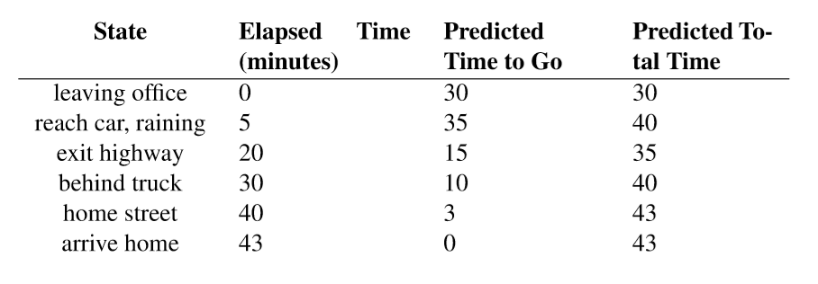
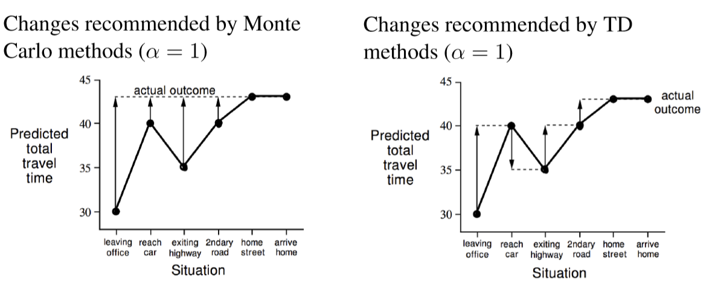
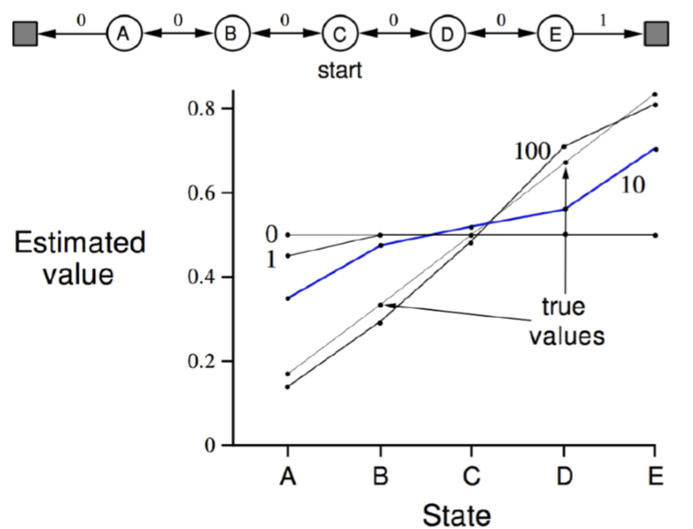
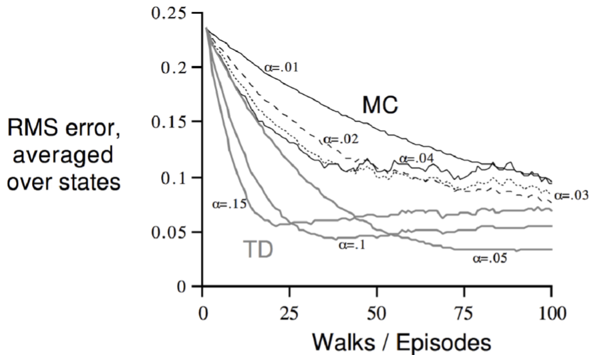
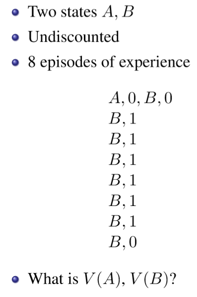
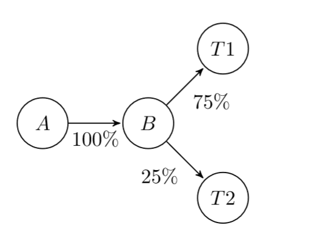
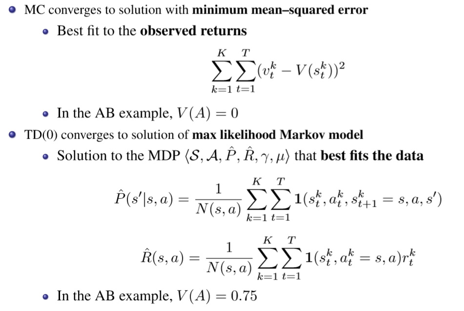
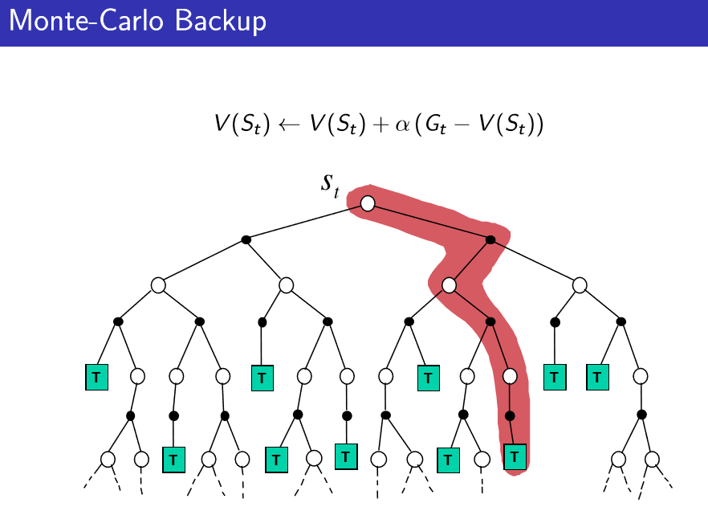
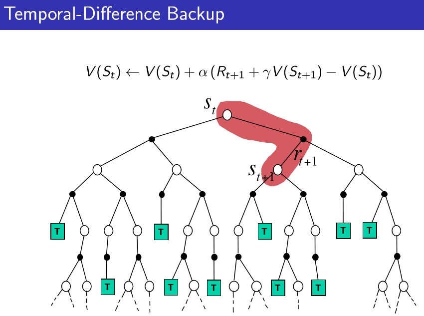

# Monte Carlo vs Temporal Difference

***Describe the differences existing between the Montecarlo and the Temporal Difference methods in the model-free estimation of a value function for a given policy.***  
If you are looking for a concise answer just go to the end.  
Monte Carlo and Temporal Difference are two different algorithms to solve Model Free Reinforcement Learning planning problems.

The question asks us to find the differences between MC-Prediction and TD-Prediction, so let's first write down both update equations:  

*Monte-Carlo Update:*  
The following updates are used *each time* an episode ends.  
For each state ${s_t}$ with return ${v_t}$: 

Stationary Case:
$$
N(s_t)\leftarrow N(s_t)+1
$$

$$
V(s_t)\leftarrow V(s_t)+ \frac{1}{N(s_t)}\bigg(v_t-V(s_t)\bigg)
$$

Non Stationary Case (we use a running mean: we forget old episodes thanks to ${\alpha}$):
$$
\color{blue}V(s_t)\leftarrow V(s_t)+ \alpha\bigg(\color{red}v_t\color{blue}-V(s_t)\bigg)
$$
${v_t}$: the return we observed from ${s_t}$ during the current episode:  
${v_t=G_t=R_{t+1}+\gamma R_{t+2}+...+\gamma^{T-1}R_T}$

${N(s_t)}$: the total number of times I visited state ${s_t}$ along all episodes I've ever run.   
Usually, in real world scenarios, we deal with non-stationary setups: we don't want to remember everything about the past. This is the case in RL as well, because during the control task we keep on updating our policy and get better and better evaluations of our states, so we want to get rid of the contribute of old evaluations  ${\to}$ we always go with the non-stationary update function.  
(if you haven't understood this last part don't worry, it will be clearer once you study control techniques).

*TD-Update*  
$$
\color{blue} V(s_t)\leftarrow V(s_t)+\alpha \bigg(\color{red}r_{t+1}+\gamma V(s_{t+1})\color{blue}-V(s_t)\bigg)
$$
The one above is the simplest temporal-difference learning algorithm, called ${TD(0)}$. We'll use it as reference. The red colored part is called TD-target.

In this case we are updating our value function towards the estimated return after one step:  
Specifically, the estimate consists in two parts: the immediate reward ${r_{t+1}}$ plus the discounted value of the next step ${\gamma V(S_{t+1})}$. 

 

***So what are the differences between MC and TD?***

Ok, here you are:  

***Behavioral difference***  
Let's start from a concrete example:  
Imagine you are driving your car and suddenly see another car moving towards you. You think you are going to crash, but in the end the car swerves out of the way, and you don't actually crash. In MC you wouldn't get any crash in the end (because in MC, the value function is updated only in the end of the episode) so you wouldn't update your values, even if you almost died.  
In TD learning, you start thinking that everything's fine, but, when you see the car coming towards you, you immediately update you estimate of the return ("damn it, If I don't do something I'm gonna die") and choose to slow down the car (which translates into choosing the action of decelerating because it gives a better estimate of the final reward).

You asked for a second example?  here you are: 

Another driving example. We need to predict how much time we need to reach home from our office.  

- "Elapsed time" is the time passed.  
- "Predicted Time to Go" is the time we are predicting to need in order to get home from our current state.  
- "Predicted Total Time" is the total time, starting from our office, we predict to need to get home.  

So: the "Elapsed Time" from a state ${i}$ to a state ${j}$ is our reward: from the office to the car we get 5 minutes of reward, from the car to the exit of the highway we get 15 minutes of reward. "Predicted time to go" is our value function. The sum of the total elapsed time and the "Predicted Time to Go" give us the total predicted time.  
(But wait, why is the reward positive? shouldn't it be negative? yes, but it's just an example, easier to deal with positive values).

Each row corresponds to a state: the starting state is the office, then we get to the parking lot, highway, etc.  
Now, consider ${\alpha=1}$ for both MC and TD (just to make things easier). what does this mean? that we completely forget about the past (just look at the equations above and you'll find out why).  
The following charts show you how both algorithms update the value function of each state (for visualization purposes Sutton (the book) plots the predicted total time instead of the Predicted Time to Go):

MC updates every state to have a "predicted total time" equal to the end estimate, so to 43:  

$V(s) \leftarrow V(s)+ \alpha \bigg(v_t -V(s)\bigg)$

${V(lo)\leftarrow 30+1\bigg(43-(30)\bigg)=43}$  	(Elapsed Time = 0)  

${V(rc)\leftarrow 35+1\bigg(38-(35)\bigg)=38}$ 		(Elapsed Time = 5)    

${V(eh) \leftarrow 15+1\bigg(23-(15)\bigg)=23}$			(Elapsed Time = 20)  
${...}$  
The sum of each ${V}$ with the relative elapsed time always sums up to 43.

While TD updates every state to the estimate of the successor state.:   
(we are considering ${\gamma=1}$ as well)

${V(lo)\leftarrow V(lo)+1 \bigg(r_{t+1}+\gamma V(rc)-V(lo)\bigg)}$

${V(lo)\leftarrow 30 + 1\bigg(5+1\cdot35-(30)\bigg)=40}$		(Elapsed Time = 0)  

${V(rc) \leftarrow 35 + 1\bigg( 15+1\cdot 15-(35)\bigg)=30}$		(Elapsed Time = 5)  

${V(eh)\leftarrow 15 + \bigg(10+1\cdot 10-(15)\bigg)=20}$		(Elapsed Time = 20)

The sum of each ${V(S_t)}$ with the relative elapsed time always sums up to the total predicted time in state ${S_{t+1}}$.

 

**Complete/Incomplete - Episodic/Continuing environments**

- TD can learn *before* knowing the final outcome, it learns online, step by step. (online means that it learns on the go, doesn't wait the episode to be over)
- MC *must* wait until the end of the episode before the return is known.

But what if there is no episode? what if there is no final outcome?

- TD can learn from incomplete sequences
- MC can only learn from complete sequences
- TD works in continuing (non-terminating) environments
- MC only works for episodic (terminating) environments

**Bias & Variance differences**

But the major difference between this two algorithms translates into a Bias/Variance Trade-Off:  
Monte-Carlo's estimate of the value function ${v_\pi(s_t)}$ is *unbiased*:   
${G_t= R_{t+1}+\gamma R_{t+2} +...+ \gamma^{T-1}R_{T}}$  
${V}$ is an actual sample of the expected return, we are not introducing any bias.  

Temporal-Difference's estimate of the value function ${v_\pi(s_t)}$ is *biased*   

${TD}$ - ${target}$ ${= R_{t+1}+\gamma V(S_{t+1})}$

because ${V(S_{t+1})}$ is just an estimate of the value function of ${S_{t+1}}$.  
That said, TD is biased but it's much more lower variance in the return wrt MC, why?

- MC's return (${G_t}$) depends on many random actions, transitions, rewards
- TD-target depends on one random action, transition, reward

Moreover TD is more efficient, since it is much more lower variance!  
Let's see an example of this:

*Random Walk Example*:

consider the following MDP where you get zero reward for any transition but moving right from E. the episode ends only in two situations:  
When you reach the leftmost square, or the rightmost one. let's adopt a policy that makes you move to the left and to the right with 50% probability. Once we run any algorithm we should obtain something like this:
$$
V(A)=\frac{1}{6} \\
V(B)=\frac{2}{6} \\
V(C)=\frac{3}{6} \\
V(D)=\frac{4}{6} \\
V(E)=\frac{5}{6}
$$
The chart above shows you how the value estimates of each state change based on how many episodes we run. (this chart was plotted applying ${TD(0)}$).  
We can see that by running roughly 100 episode we get a good approximation of the true value function.

Now let's compare TD and MC for this example:

In the ${y}$ axis we have the total error over all states, which means "how much the function we estimated is wrong wrt to the true one".  
We can notice that we plot lines for both MC an TD and for different step sizes ${\alpha}$.  
We notice that TD does better than MC, doesn't matter how many episodes we run.  
We even notice that MC is noisier (more variance).

 

**Markov / non-Markov Environments**  

Last but non least: which of them takes advantage of the Markov property? (*the future is independent of the past given the present*). the short answer is: TD does, MC does not.

The long answer is: follow the example (we are almost done).

So far we have dealt with convergence given that we run a huge number of episodes:

${MC}$ and ${TD}$ converge: ${V(s) \to v_\pi(s)}$ as experience ${\to \infty}$.

But what if we can't run a huge number of episodes? what if we are provided with 8 episodes and we should learn only from them? In this case we would get a *batch* solution: we would repeatedly sample from our ${k}$ episodes to learn everything we can.

To get an intuition consider the following problem:

Each line corresponds to an episode, and each episode correspond to a sequence of states and rewards.  
if we run Monte-Carlo we would get ${V(A)=0}$ and ${V(B)=\frac{6}{8}}$. Why? In every episode we saw ${A}$ we got a total reward of ${0}$ (we visit it only in the first episode), so it makes sense that, even if we run 1000 times the first episode we would still get ${V(A)=0}$.  
This is a completely legit value for ${A}$.  
${V(B)=\frac{6}{8}}$ because, if we run ${k}$ times our 8 episodes, we get that ${6k}$ times out of the ${8k}$ we encountered ${B}$, we got a total reward of 1.

Now let's run ${TD(0)}$:  
${V(A)=\frac{6}{8}}$ and ${V(B)=\frac{6}{8}}$.  
Why? the return of ${A}$ has changed? you could see it like this:  
In ${TD}$, in the first episode, we have that
$$
V(A)\leftarrow V(A)+\alpha \bigg(r_{t+1}+\gamma V(B)-V(A)\bigg) \\
  V(A)\leftarrow V(A)+\alpha \bigg(0+\gamma V(B)-V(A)\bigg)
$$
the expected return of ${B}$ will become ${\frac{6}{8}}$ so ${V(A)}$ gets updated toward that value.  
${TD}$ is able to capture, *even in finite experience situations*, the Markov property.  
${TD}$, *even in finite experience situations*, is able to build an MDP model, ${MC}$ can't! 

This is what ${TD}$ builds:  

if you want to have a look to the math behind all of this here you are:  

MC would still capture partially the Markov property if it was given a higher number of episodes to deal with, but, since he can deal with just those 8 ones (and those 8 ones are not very representative of the model) it can't capture the structure of the MDP. 

**Function Approximation**

What is function approximation? well, in most cases we have tons and tons of states, and it's not very efficient to compute the value function of each single state, so with function approximation we mean that we compute an approximate value for some states' value function.

it's bad to use function approximation in TD because, once you update the value of a certain ${s}$, you need to update the linear equation that approximates the behavior of each value of ${V}$ wrt to the states ${s' \neq s}$.

Ok, we are done, what follows is a concise summary of the differences between the two algorithms:

 

**Concise Summary**

if you want to briefly answer the question you could probably just say the following:

- *MC*
  - **high variance, zero bias**
  - good convergence properties
  - converges even with function approximation
  - Not very sensitive to initial value
  - Very simple to understand and use
  - learns only from **complete** sequences
  - works only **offline**, must wait the end of an episode to be run
  - Must be run only for **episodic** environments
  - usually more effective in non-Markov environments $\to$ **does not exploit Markov property**
  - usually **less efficient** than TD because of higher variance.
- *TD*
  - **low variance, some bias**
  - ${TD(0)}$ converges to ${V_\pi(s)}$
  - doesn't always converge with function approximation
  - more sensitive to the initial value
  - learns even from **incomplete** sequences
  - can learn **online**, after every step
  - works for both **episodic** and c**ontinuing** environments (not necessary to know the final outcome)
  - usually more effective in Markov environments $\to$ **exploits Markov property**
  - usually **more efficient** than MC because of lower variance.

(  Sources: David Silver's Slides;  [David Silver's RL Lecture 04](https://www.youtube.com/watch?v=PnHCvfgC_ZA&t=1702s)  ) 

 

### 