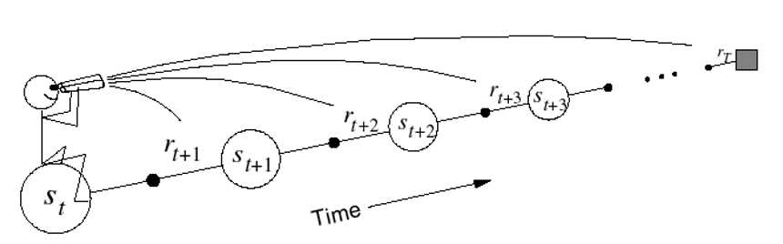
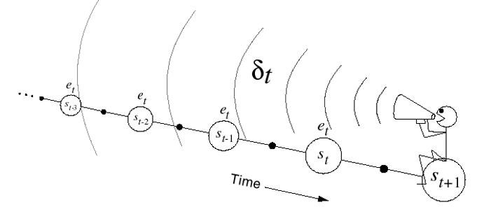
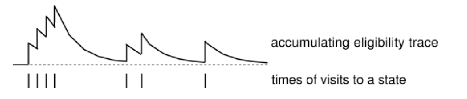

# Eligibility Traces

***Describe what are eligibility traces and how they are used in the TD(λ) algorithm. Explain what happens when λ = 0 and when λ = 1.***   
If you are interested in the concise answer read from the section *Eligibility Traces* on.  
First of all let's give some contest. 
***TD(${ \lambda}$)***  
It's a Temporal Difference algorithm that consists in averaging over ${n}$-steps returns over different ${n}$. This is done in a weighted way, using the value ${ \lambda}$.

***Forward-View ${TD(\lambda) }$***

Forward-View is an offline algorithm ${\to}$ needs to run the entire episode.  
$$
V(s_t) \leftarrow V(s_t)+\alpha (v_t^\lambda -V(s_t))  
\\
v_t^\lambda=(1-\lambda)\sum_{n=1}^\infty \lambda^{n-1}v_t^{(n)}
$$
where
$$
v_t^{(\color{red}n\color{black})}=r_{t+1}+\gamma r_{t+2}+...+\gamma^{\color{red}n\color{black}-1}r_{t+\color{red}n\color{black}} +\gamma^{\color{red}n\color{black}}V(s_{t+\color{red}n}\color{black})
$$
  

- Updates the value function towards the ${ \lambda}$ return 
- Forward-View looks into the future to compute the target ${v_t^\lambda}$
- Like MC, can only be compute from complete sequences

***Backward-View ${TD(\lambda)}$***

This is an online algorithm, so there is no need for the episodes to be complete.  

- It keeps an eligibility trace for every state ${s}$ (we'll explain them soon)

- It updates value ${V(s)}$ for every state ${s}$ in proportion to the ${TD}$-error ${\delta_t}$ (one-step error!) and the eligibility trace ${e_t(s)}$  
  $$
  \\
  V(s) \leftarrow V(s)+\alpha \delta_te_t(s)
  \\
  \ 
  \\
  \delta_t=R_{t+1}+ \gamma V(S_{t+1})-V(S_t)
  $$

Intuition: imagine to be a rat, and you notice that usually, when a bell rings three times and the light of the room gets turned on, you get electrocuted.  

It has many advantages:

- It updates the weight vector on every step of an episode rather than only at the end, and thus its estimates may be better sooner.
- Its computations are equally distributed in time rather than all at the end of the episode. 
- It can be applied to continuing or incomplete episodes problems rather than just complete episodes problems.

How to do it?

Thanks to Eligibility Traces. 

***Eligibility Traces***

Eligibility Traces are used in Backward-View ${TD(\lambda)}$ algorithms, both for prediction and control.   
An *Eligibility Trace* is a short-term memory vector${\mathbf{e}_t \in \R^d}$ .  
When a state is visited, the corresponding component of ${\mathbf{e}_t}$ is bumped up and than begins to fade away. So, for a given state ${s}$ , the update of ${V(s)}$ will occur in proportion to the ${TD}$-error ${\delta_t}$ and to the eligibility trace ${e_t(s)}$.  
The *trace-decay* parameter ${\lambda}$ determines the rate at which the trace falls.  
$$
e_0(s)=0 
\\
e_t(s)=\gamma\lambda e_{t-1}(s)+ \mathbf{1}(s=s_t)
\\
\ 
\\
\delta_t=R_{t+1}+ \gamma V(S_{t+1})-V(S_t)
\\
\
\\
\color{blue} 
V(s) \leftarrow V(s)+\alpha \delta_te_t(s)
$$
The pseudo-code for ${e_t(s)}$ says that ${e(t)}$ decays of a factor ${\gamma \lambda}$ when it's not visited, but, when it's visited, it does decay of that same factor and at the same time gets incremented by ${1}$.

The eligibility trace keeps track of which states have contributed, positively or negatively, to recent state valuations, by combining both *frequency heuristics* (assign credit to the most frequent states) and *recency heuristics* (assign credit to the most frequent states).  

***What happens for ${\lambda=0}$ and ${\lambda=1}$?***

*${\lambda=0}$*:  
When ${ \lambda=0}$, only the current state gets updated.  
$$
e_t(s\neq s_t)= \gamma \cdot0\cdot e_{t-1}(s)+0=0 
\\
e_t(s=s_t)=\gamma\cdot 0 \cdot e_{t+1}(s)+1=1
\\
V(s) \leftarrow V(s)+\alpha \delta_te_t{(s)} \ \ \ \ \ \ \ \ \ \ \ \  \ \forall s
$$
Which is exactly equivalent to ${TD(0)}$'s  update:  
$$
V(s) \leftarrow V(s)+\alpha \delta_t \ \ \  \ \ \ (s=s_t)​
$$
*${\lambda=1}$*:    

It's roughly equivalent to Every-Visit Monte-Carlo, we'll see why.  
Consider an episode where any state ${s}$ is visited at time-step ${k}$.  
${TD(1)}$ eligibility trace for ${s}$ gets discounted from the moment it's visited ${(t=k)}$:
$$
e_t(s)=\gamma e_{t-1}(s)+\mathbf{1}(s_t=s) 
\\
= \begin{cases}
0 \ \ \ \ \ \  \ \ \ if \ \  \ t<k
\\
1 \ \ \ \ \ \ \ \  \  if \ \ \ t=k
\\
\gamma^{t-k} \ \ \ \  if \ \ \ t>k

\end{cases}
$$
The second and third case can be merged:  ${e_t(s)=\gamma^{t-k} \ \ \ \ if \ \ \ t \ge k}$, I wrote it like that just because I think it's more intuitive. 

So ${TD(1)}$ updates accumulate errors *online*
$$
\sum_{t=1}^{T-1}\alpha \delta_t e_t(s)=\alpha \sum_{t=k}^{T-1}\gamma^{t-k}\delta_t=\alpha (G_k-V(s_k))
$$
How did we get to the last equation? let's see:  
By the end of the episode it accumulates the total error:
$$
\delta_k+\gamma\delta_{k+1}+\gamma^2\delta_{k+2}+...+\gamma^{T-1-k}\delta_{T-1}
$$
Just by rearranging such total error  we understand that, for  ${\lambda=1}$, the sum of TD errors telescopes into ${MC}$ error.
$$
\delta_k+\gamma\delta_{k+1}+\gamma^2\delta_{k+2}+...+\gamma^{T-1-k}\delta_{T-1} \\
=R_{t+1}+\gamma V(s_{t+1})-V(s_t) 
\\
+\gamma R_{t+2}+\gamma^2 V(s_{t+2})-\gamma V(s_{t+1})
\\
+ \gamma ^2 R_{t+3} + \gamma^3 V(s_{t+3})-\gamma^2 V(s_{t+2})

\\
\vdots
\\

\gamma^{T-1-t}R_T
+\gamma^{T-t}V(s_t)-\gamma^{T-1-t}V(s_{t-1})
\\
=R_{t+1}+\gamma R_{t+2}+\gamma^2R_{t+3}+...+\gamma^{T-1-t}R_t-V(s_t)
\\
=G_t-V(s_t)
$$
So ${TD(1)}$ is roughly equivalent to every-visit Monte-Carlo. Why roughly? because the total error is accumulated online, step-by-step.  
If the value function was updated offline, at the end of the episode, then the total update would have been exactly the same as MC.  

Important observation (not needed for answering the question though):  
*The sum of offline updates is identical for forward-view and backward-view ${TD(\lambda)}$*  
$$
\sum_{t=1}^T\alpha \delta_te_t(s)=\sum_{t=1}^{T}\alpha \bigg(v_t^\lambda -V(s_t)\bigg)\mathbf{1} (s_t=s)
$$
(Sources: David Silver's Slides on Prediction - Restelli's Slides on Finite MDPs)