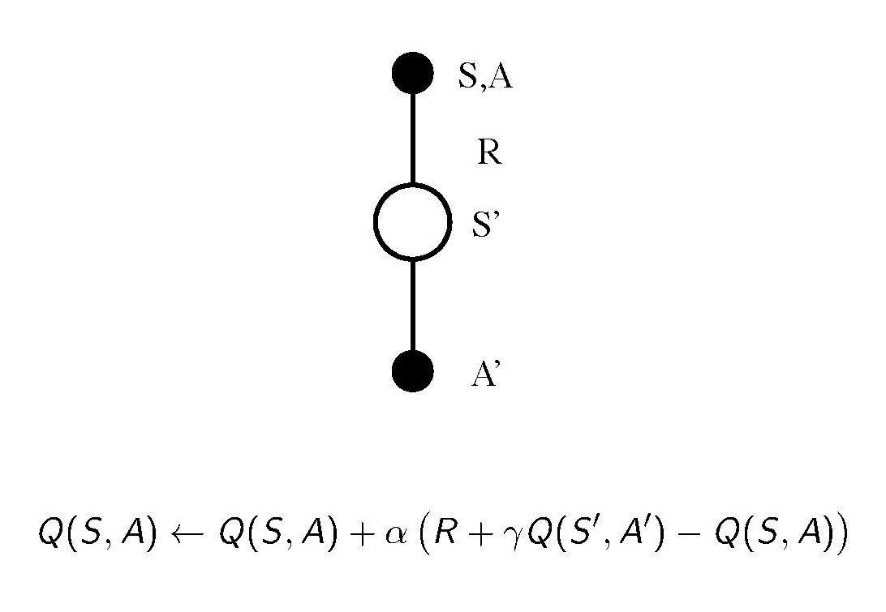
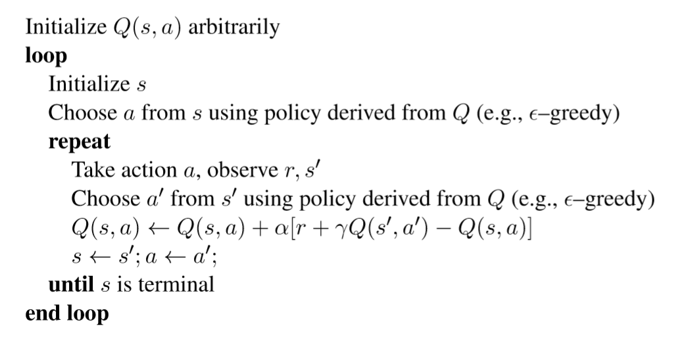
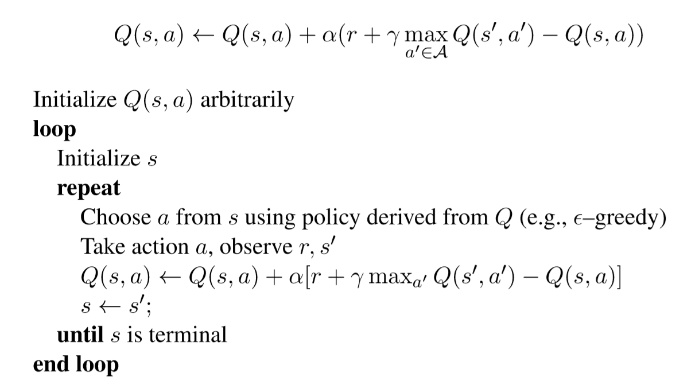

# Q-Learning vs SARSA

***Describe the differences existing between the Q-learning and SARSA algorithms***  
First of all, let's say what they are used for:  
*SARSA* and *Q-Learning* are two algorithms used to do control using the model free method called *Temporal Difference*.   
If you don't remember what a control task is, here you are:   
*Control is the task of obtaining an improved policy ${\pi'}$ starting from a policy ${\pi}$.*  
Now let's jump into the differences:  
Q-Learning is an example of off-policy learning, while SARSA is an example of on-policy learning.   
It implies that    

- Q-learning uses a target policy $\pi$  (which is greedy) to choose the best next action ${a'}$ while following a behavior policy  $\bar{\pi}$ (which is ${\epsilon}$-greedy). this means off-policy.
  ${Q(S_t,A_t)\leftarrow Q(S_t,A_t)+ \alpha \big( \color{red} R_{t+1}+\gamma \max_{a' \in A}  Q(S_{t+1},a') \color{black} - Q(S_t,A_t)\big)} $   

  

- SARSA learns the optimal Q-value based on the actions performed following its own policy. this means on-policy. 
  ${Q(S_t,A_t)\leftarrow Q(S_t,A_t)+\alpha (\color{red} R+\gamma Q(S_{t+1},A_{t+1}) \color{black} -Q(S_t,A_t))}$   

If you want to get a full understanding of both algorithms, here you are:

***SARSA Algorithm***  

  

It's called SARSA because the agent starts in ${S}$, performs action ${A}$ following its own policy.   
Afterwards, we are going to randomly sample from our environment to see what reward ${R}$ we receive and that state ${S'}$ we end up in.  
then we are going to sample again from our policy to generate ${A'}$.  
So basically, SARSA, indicates a particular update pattern we can use.  
*Updating ${Q}$ functions with SARSA*:  
${Q(S,A)\leftarrow Q(S,A)+\alpha (\color{red} R+\gamma Q(S',A') \color{black} -Q(S,A))}$

We move our ${Q}$ value a little bit in the direction of our TD target (the red colored part) minus the ${Q}$ value of where we started.  
This update is done after every transition from a nonterminal state ${s}$. If ${s'}$ is terminal, then ${Q(s',a')}$ is zero.

*Policy Improvement/ Control with SARSA*:  
Ok, so far we just evaluated our ${Q}$ function. Implicitly we did Policy Evaluation. How do we do Policy Improvement when we apply SARSA?

we simply use an ${\epsilon}$- greedy policy improvement:  

- All ${m}$ actions are tried with non-zero probability.
- With probability ${1-\epsilon}$ we choose the greedy action
- With probability ${\epsilon}$ we choose an action at random (possibly we select the greedy one!)

$$
  \pi(s,a)=\begin{cases}\frac{\epsilon}{m}+1-\epsilon  \ \ \ \ if \ \    a^*=arg\max_{a\in A} Q(s,a) \\
  \frac{\epsilon}{m} \ \ \ \ \ \ \ \ \ \ \ \ \ \ \ \ \ otherwise\end{cases} 
$$

Complete algorithm for SARSA:

***Q-Learning***  

Consider being in state ${S_t}$ and selecting our next action following our behavioral policy: ${A_{t+1}\sim \bar{\pi}(\cdot |S_t)}$.  
In the meanwhile consider some alternative successor action that we might have taken following our target policy ${A'\sim\pi(\cdot|S_t)}$. 
Finally we update our ${Q}$-value for the state we started in and the action that we actually took (${Q(S_t,A_t)}$) towards the value of our alternative action ${A'}$. 

${Q(S_t,A_t)\leftarrow Q(S_t,A_t)+ \alpha( \color{red} R_{t+1}+\gamma Q(S_{t+1},A') \color{black} - Q(S_t,A_t))}$

${S_t}$ = actual state  
${A_t}$= actual action taken following behavioral policy ${\pi}$.   
${\alpha}$ = learning rate  
${R_{t+1}}$ = actual reward taken by performing ${A_t}.$    

${\gamma}$ = discounting factor.  
${S_{t+1}}$= successor state.

${A'}$ = action sampled from our target policy in state ${S_t}$. 

A special case of this updating process is the Q-Learning algorithm.  
In this case, the target policy ${\pi}$ is a greedy policy wrt ${Q(s,a)}$ and the behavior policy ${\bar{\pi}}$ is ${\epsilon}$-greedy wrt ${Q(s,a)}$.
$$
\pi(S_{t+1})=\arg\max_{a'}Q(S_{t+1},a')
$$
Let's update the new estimation of the final return:
$$
R_{t+1} +\gamma Q(S_{t+1},A')=          \ \ \ \ \ \ \ \ \ \ \ \ \ \ \ \ \ \ \ \ \ \ \ \ \ \ \ \
$$

$$
R_{t+1}+\gamma Q(S_{t+1},\arg\max_{a'}Q(S_{t+1},a') )=
$$

$$
R_{t+1}+\max_{a'} \gamma Q(S_{t+1},a') \ \ \ \ \ \ \ \ \ \ \ \ \ \ \ \ \ \ \ \ \ \ \ \ \ \ \
$$

If we plug this estimation in the general Q update equation I described earlier, just by replacing the  
old red colored component with the new one, we obtain the Q-update equation for Q-Learning:     
$$
Q(S_t,A_t)\leftarrow Q(S_t,A_t)+ \alpha \big( \color{red} R_{t+1}+\gamma \max_{a' \in A}  Q(S_{t+1},a') \color{black} - Q(S_t,A_t)\big)
$$
Complete algorithm for Q-Learning:

(Sources: [Model Free Algorithms](https://medium.com/deep-math-machine-learning-ai/ch-12-1-model-free-reinforcement-learning-algorithms-monte-carlo-sarsa-q-learning-65267cb8d1b4) - [Deep Mind Model Free Control](https://www.youtube.com/watch?v=0g4j2k_Ggc4&list=PLqYmG7hTraZDM-OYHWgPebj2MfCFzFObQ&index=5) )